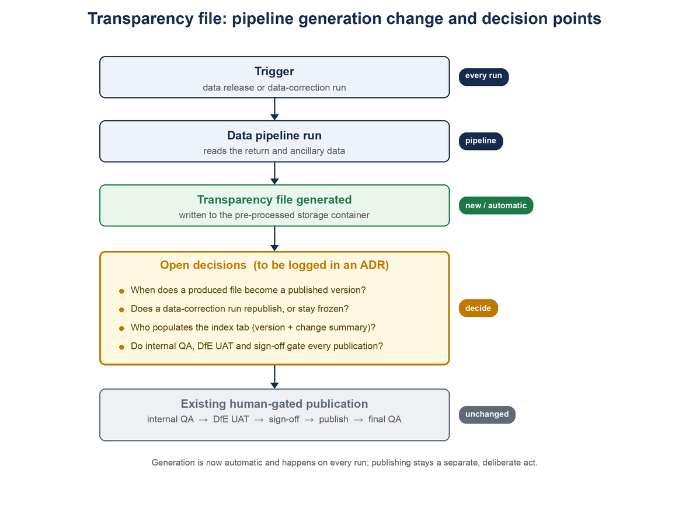

# Transparency File: Pipeline Generation Change

## Purpose

This is the second document in the series. It records the change now in place: the transparency files, for both CFR and AAR, are generated by the FBIT data pipeline on every run. It sets out how that change affects the current (as-is) process and the decisions the team needs to make. It does not resolve them; the decisions will be logged in an ADR.

## What has changed

In the [current as-is process](./1_Current-As-Is-Process.md), each transparency file was generated by a data analyst running SQL scripts, as a deliberate step inside a human-gated release process.

Now, the transparency files are generated automatically inside the data pipeline. The SQL scripts are retained only for regenerating historical data.

The important part is the frequency: the pipeline regenerates the file on **every run**. We run the pipeline for every data release and every time we correct something in the data, so the file is now produced far more often than it is published.

## The new pipeline generation

On each run, the pipeline reads the raw return and ancillary data and builds the transparency output, writing it to the `pre-processed` storage container. This replaces the manual SQL generation.

One point matters for everything that follows: the pipeline produces a **CSV** (the raw download data). That CSV is converted into the published Excel workbook in the correct format, so the file format itself is handled. What is not handled is the **index tab**: the version number and change summary are not populated. The pipeline also does not carry out any of the QA, UAT, sign-off, publish, or freeze steps. Those remain outside the pipeline.

## How this impacts the as-is process

Mapping the as-is steps to what changes:

| As-is step                                        | Impact                                                                                                                                                                   |
|:--------------------------------------------------|:-------------------------------------------------------------------------------------------------------------------------------------------------------------------------|
| Go-ahead and data cut                             | Still needed for a release, but data-correction runs also trigger the pipeline without a release go-ahead, so a file is now produced outside the normal release cadence. |
| Source the ancillary data                         | The pipeline reads the ancillary data as part of the run, so manual local-database sourcing is no longer the route for generation.                                       |
| Generate the transparency file                    | Replaced: generation is now automatic inside the pipeline, on every run.                                                                                                 |
| Internal QA, DfE UAT, Sign-off, Publish, Final QA | Unchanged in principle, still manual and human-gated, but they now act on a file the pipeline regenerates on every run rather than a file produced once, deliberately.   |

Key consequences:

1. **Generation is decoupled from publication.** Producing the file used to be the deliberate act. Now generation is automatic and frequent, and publication is the remaining deliberate, gated act.
2. **The file is produced on every run,** including data-correction runs, re-runs, and test runs, most of which are not intended to publish a new transparency version.
3. **Fresh produced file versus frozen published file.** The as-is policy freezes the published file and does not update it when the service data is corrected. The pipeline, by contrast, regenerates the file on every correction. So a fresh, corrected file now exists after a fix, while the published file stays frozen. That gap is new.
4. **Index versioning gap.** The CSV is converted into the correctly formatted Excel workbook, but the index tab (the version number and what changed) is not populated automatically. That is the outstanding gap on the file itself.
5. **Overwrite.** Each run overwrites the produced file in `pre-processed`, so there needs to be a clear rule for which produced file is the candidate for a given release's publication.

## Decisions we need to make

Yes, the change raises decisions the team needs to agree. They apply equally to the CFR and AAR transparency files. This document only states them; the decisions will be logged in an ADR.

* **D1. Publication trigger:** when does a pipeline-produced file become a published version? On every run, only on releases, or only when explicitly chosen?
* **D2. Freeze versus refresh on corrections:** now that the pipeline regenerates the file whenever we correct data, do we republish the corrected file, or keep the current freeze policy (not updated after sign-off)?
* **D3. Index tab and versioning:** who populates the version number and change summary, now that the Excel workbook is produced automatically? A manual step, an input to the pipeline run, or generated as part of the run? This is the one outstanding gap on the file itself.
* **D4. Human gates:** do internal QA, DfE UAT, and DfE sign-off still gate every publication, and how do they fit now that generation is automatic and frequent?
* **D5. Storage and promotion:** where does the produced file live, and how is a chosen version promoted from `pre-processed` to the published storage and the version index used by the service?

## What stays the same

* Publication remains human-gated (internal QA, DfE UAT, DfE sign-off): the assurance model is unchanged in principle.
* The published artefact is still a versioned workbook, listed on the service and downloaded by users.
* The transparency file remains separate from, and can lag, the main data release.

## References

* [Current (As-Is) Process](./1_Current-As-Is-Process.md): the process this change affects.
* `data-pipeline/src/pipeline/pre_processing/`: the pipeline pre-processing stage that generates the transparency files.
* [Data release guide: CFR](../data-release-guide/03_CFR.md) and [AAR](../data-release-guide/02_AAR.md).

<!-- Leave the rest of this page blank -->
\newpage
