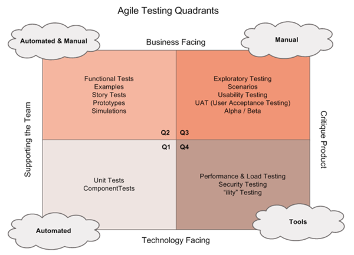
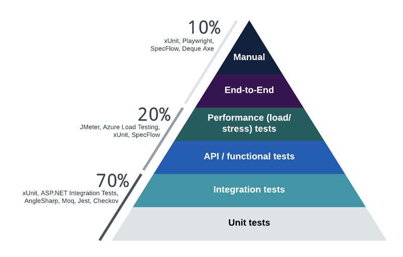

# Test Strategy: FBIT Service

## Purpose

This Test Strategy outlines the overall testing direction for the FBIT service, which integrates financial benchmarking and analysis tools into a single system for various user roles including internal DfE users, external users, and service administrators. It ensures that the FBIT Application and FBIT Data Pipeline are robust, reliable, secure, and deliver accurate financial insights.

## Scope

**In-Scope:**
- FBIT Application UI and API testing.
- Data Pipeline processing logic, validation, and transformations.
- Integration between UI, API, and data pipeline layers.
- Accessibility, API, cross-browser, and end-to-end tests.
- User Role testing (DfE User, External User, Service Owner/Admin).
- UAT with synthetic and production-like data.
- Error handling, logging, and failover behaviour.

**Out-of-Scope:**
- Full performance/load testing (planned post-live).
- Legacy systems VMFI/SFB (only their integration aspects are considered).
- External systems outside the FBIT ecosystem.

## Architecture-Based Testing Breakdown

| Component           | Description                                                                 | Testing Focus Areas                                                 |
|---------------------|-----------------------------------------------------------------------------|---------------------------------------------------------------------|
| FBIT Application    | Front-end UI and APIs for financial comparison and benchmarking             | UI rendering, API responses, accessibility, authentication, UX      |
| FBIT Data Pipeline  | Processes raw school financial data, generates comparator sets & RAG status | Schema validation, transformation accuracy, data quality, ETL logic |
| DfE Users           | Internal users accessing data via FBIT App                                  | Role-based access control, data visibility, business logic accuracy |
| External Users      | General public users                                                        | Data anonymization, performance, usability                          |
| Admin/Service Owner | Manage pipeline operations and view dashboards                              | Uploading raw data, running pipelines, error monitoring             |

## Test Types and Techniques

The following diagram shows the Agile Testing Quadrants outlining where each different type of testing sits, its order of implementation, and the associated categories.

The testing pyramid below shows the value of implementing different types of automated testing within a software project.

| Test Type             | Purpose                                                         | Responsible        | Tooling                               |
|-----------------------|-----------------------------------------------------------------|--------------------|---------------------------------------|
| Unit Testing          | Test individual functions or methods                            | Developers         | xUnit, Moq, AutoFixture               |
| Integration Testing   | Verify interaction between modules/components                   | Developers/Testers | ASP.NET Integration Tests, AngleSharp |
| API Testing           | Validate request/response formats, status codes, data integrity | Test Engineers     | xUnit, FluentAssertions, Postman      |
| Feature/E2E Testing   | Simulate real user flows                                        | Test Engineers     | Playwright, Reqnroll                  |
| Accessibility Testing | Ensure compliance with WCAG 2.2 AA standards                    | Test Engineers     | axe-core with Playwright              |
| Manual Acceptance     | Explore edge cases and verify stories meet acceptance criteria  | Test Engineers     | Test charters, DevOps tickets         |
| Cross-Browser Testing | Ensure functionality across browsers and platforms              | Test Engineers     | BrowserStack                          |
| UAT                   | Validate production-like scenarios and data accuracy            | Whole Team         | Automated/manual tests on staging env |

## Test Environments

| Environment | Purpose                       | Notes                                           |
|-------------|-------------------------------|-------------------------------------------------|
| Local       | Developer testing             | Unit tests, early manual checks                 |
| d01         | Development                   | Manual acceptance                               |
| d02         | Automated testing environment | API, E2E, A11y                                  |
| t01         | Test                          | End-to-end integration and exploratory testing  |
| Pre-Prod    | UAT                           | Realistic dataset, full regression, UAT         |
| Production  | Live system                   | Post-deployment smoke tests (basic checks only) |

## Supported Browsers

Focus will be give to Chrome browser on Windows and macOS and Edge on windows considering the insights we have from the previous system. The rest of the browsers shown below will be checked on adhoc basis.

| Operating System | Browser                      | Versions                     |
|------------------|------------------------------|------------------------------|
| Windows          | Edge                         | Latest                       |
|                  | Google Chrome                | Latest                       |
|                  | Mozilla Firefox              | Latest                       |
| macOS            | Safari                       | 12 and later                 |
|                  | Google Chrome                | Latest                       |
|                  | Mozilla Firefox              | Latest                       |
| iOS              | Safari for iOS               | 12.1 and later               |
|                  | Google Chrome                | Latest                       |
| Android          | Google Chrome                | Latest                       |
|                  | Samsung Internet             | Latest                       |

## Test Data Strategy

- **Synthetic Data**: For development, automated tests, and early integration testing.
- **Production-like Data**: For UAT and final verification, covering real-world scenarios.
- **Error Cases**: Data with schema violations, missing fields, or incorrect formats to test ETL robustness.

Test data will be managed and generated in collaboration with the Data Engineering team.

## Roles and Responsibilities

| Role          | Responsibilities                                                 |
|---------------|------------------------------------------------------------------|
| Test Engineer | Test case design, automation, exploratory testing, quality gates |
| Developer     | Unit and integration testing, testability reviews                |
| Product Owner | Acceptance criteria, UAT sign-off                                |
| Data Engineer | Test data generation, pipeline validation                        |
| Admin User    | Conducts pipeline runs, verifies backend calculations            |

## Entry and Exit Criteria

**Entry Criteria:**
- User Story is Dev-complete.
- All unit and integration tests are passing.
- Feature branch is merged and deployed to testing env.

**Exit Criteria:**
- All acceptance criteria met and verified.
- Automated tests implemented (unit, integration, E2E).
- Accessibility tests pass WCAG 2.2 AA checks.
- Cross-browser compatibility confirmed.
- UAT completed and signed off.

## Risks and Mitigations

| Risk                                               | Mitigation Strategy                                            |
|----------------------------------------------------|----------------------------------------------------------------|
| Incomplete test coverage due to sprint constraints | Align test planning with grooming; prioritize test cases       |
| Delayed data pipeline readiness                    | Create mock pipeline outputs for earlier test integration      |
| Browser/device fragmentation                       | Focused testing on Chrome/Edge, ad-hoc others via BrowserStack |
| Data format/schema issues in raw files             | Define and validate schema contracts early                     |

## Quality Metrics

| Metric                         | Description                                      |
|--------------------------------|--------------------------------------------------|
| Test Coverage                  | % of code and stories with automated tests       |
| Defect Density                 | Number of defects per module/feature             |
| Test Case Pass Rate            | % of test cases passed vs. total executed        |
| Time to Detect and Fix Defects | Average time from defect detection to resolution |
| UAT Issue Rate                 | Number of UAT-reported issues                    |

## Reporting and Communication

- DevOps will be used to manage stories, test cases, and defects.
- Daily stand-ups and sprint ceremonies will include test updates.
- UAT outcomes and bug summaries will be shared as reports or dashboards.
- Slack/Teams for real-time collaboration.

## Tools Stack Summary

| Purpose           | Tool                    |
|-------------------|-------------------------|
| Unit/Integration  | xUnit, Moq, AutoFixture |
| E2E/UI Automation | Playwright, Reqnroll    |
| API Testing       | xUnit, FluentAssertions |
| Accessibility     | Deque.axe.playwright    |
| Cross-browser     | BrowserStack            |
| Pipeline Testing  | Custom Scripts + Manual |
| Test Management   | Azure DevOps            |

<!-- Leave the rest of this page blank -->
\newpage
