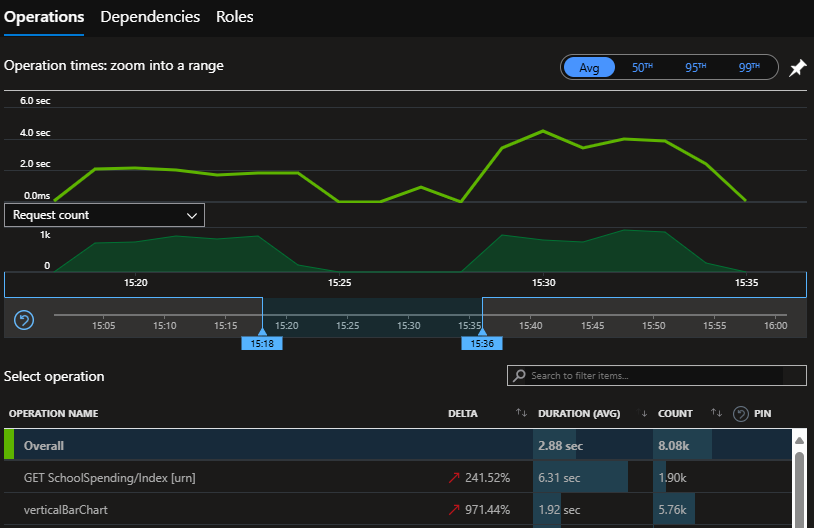
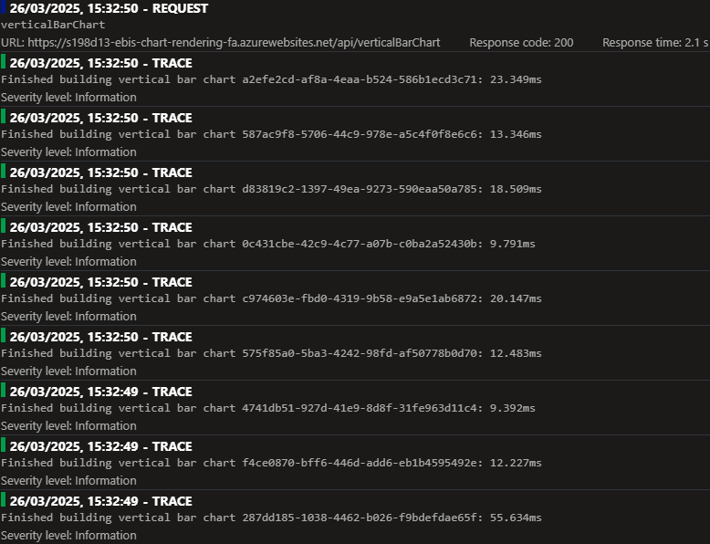
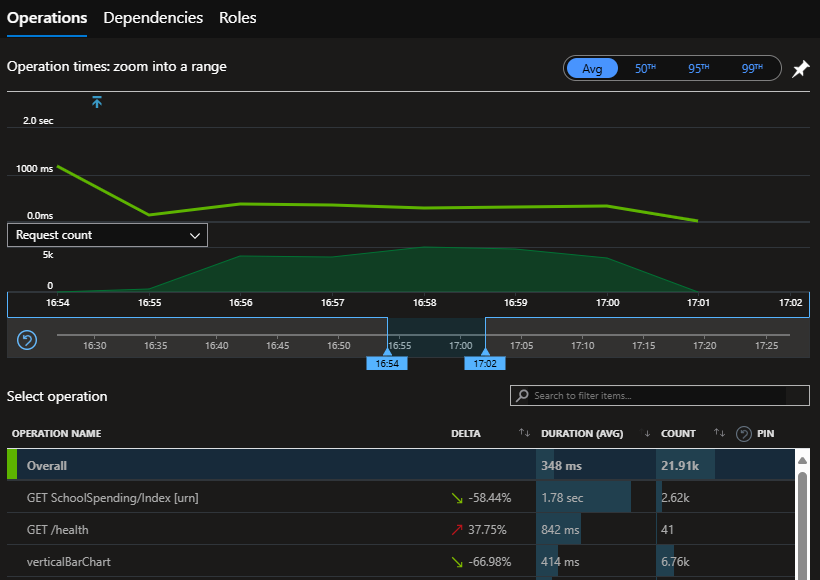
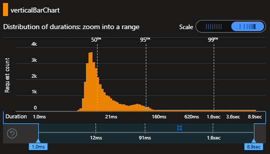
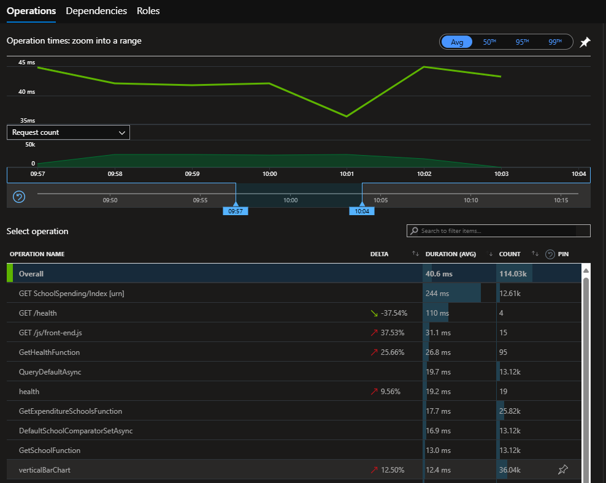

# Performance Test Plan - 0007 - API and Web School Spending and Priorities load tests for SSR charts

**Test run date:**

March 2025

## Goal

The goal of this test is to measure the impact of replacing client rendered charts with server side rendered ones.
This includes API, URL and Web tests in order to include coverage over downloaded Web assets.

## Objective

- Establish performance baselines for:
  - typical load conditions using a URL based test on the API directly
  - peak conditions using a URL based test on the API directly
  - typical load conditions using a URL based test
  - peak conditions using a URL based test
  - typical load conditions using a Web based test
  - peak conditions using a Web based test
- Compare all of the above once [SSR chart spike](https://dfe-ssp.visualstudio.com/s198-DfE-Benchmarking-service/_workitems/edit/248027) is complete
- Compare Web based tests during development of the above in a feature environment (`d13`)

## Procedure

**Determine Capacity:**

Calculate the number of `Virtual Users` required for Azure Load Testing based on a target throughput.

_NB: see previous test plans for calculation._

**Average Load Phase:**

For each endpoint, simulate the typical number of concurrent virtual users to mimic average load conditions over a period of 5 minutes.

**Peak Load Phase:**

For each endpoint, simulate the typical number of concurrent virtual users to mimic peak load conditions over a period of 5 minutes.
Manually scale core database to S2 tier to replicate production infrastucture for the duration of the peak load tests.

**Monitoring Performance:**

- Response Time
  - Definition: The duration between sending a request and receiving a response.
  - Measurement: This will be produced as an output of the test run.
- Error Percentage
  - Definition: The percentage of requests that result in an error response (5xx).
  - Measurement: This will be produced as an output of the test run.
- Throughput
  - Definition: The number of requests processed per second.
  - Measurement: This will be produced as an output of the test run.
- CPU and Memory utilisation
  - Definition: The average percentage utilisation.
  - Measurement: Monitor resource usage to ensure the infrastructure efficiently handles the load.
- Database performance
  - Definition: The average percentage of DTU utilisation.
  - Measurement: Monitor resource usage to ensure the infrastructure efficiently handles the load.

**Pages Under Test:**

| Page                                      | Test Type | Load Type | DB DTUs |
|-------------------------------------------|-----------|-----------|---------|
| `/school/{identifier}/spending-and-costs` | URL       | Average   | S1      |
| `/school/{identifier}/spending-and-costs` | URL       | Peak      | S2      |
| `/school/{identifier}/spending-and-costs` | Web       | Average   | S1      |
| `/school/{identifier}/spending-and-costs` | Web       | Peak      | S2      |

**Endpoints Under Test:**

| Endpoint                     | Load Type | Target Throughput |
|------------------------------|-----------|-------------------|
| `POST /api/verticalBarChart` | Average   | 105 /s            |
| `POST /api/verticalBarChart` | Peak      | 158 /s            |

## API Performance Success Criteria

- Response Time:
  - P50 below 100ms
  - P95 below 150ms
  - P99 below 500ms
- Peak Response Time:
  - P75 below 250ms
  - P95 below 500ms
  - P99 below 1000ms
- Error Rate: below 0.1% *

## Test Execution

- Load pattern: Linear
- Test duration (minutes): 6
- Ramp-up time (minutes): 1

## Test Output

<!-- take care with final separator line in piped table, as pandoc uses this for relative column widths -->
| Load Test Name                                     | Environment & Infrastructure                       | Initiated on         | Max VUs | Duration | Response time | Errors | Throughput | Result |
|----------------------------------------------------|----------------------------------------------------|----------------------|---------|----------|---------------|--------|------------|--------|
| Average URL (baseline)                             | `t01`                                              | 20/03/2025, 07:06:46 | 15      | 6m       | 320 ms        | 0.01 % | 49.99 /s   | [✅ Passed](https://portal.azure.com/#blade/Microsoft_Azure_CloudNativeTesting/NewReport/resourceId/%2Fsubscriptions%2Fa5c0a8d7-a54d-4a6d-ab79-4ca64a3b750f%2Fresourcegroups%2Fs198t01-ebis-perf-tests%2Fproviders%2Fmicrosoft.loadtestservice%2Floadtests%2Fs198t01-load-tests/testId/64328db8-47e9-4214-9182-b5b7505ff027/testRunId/ffdcb805-e405-4f6b-a735-cbcb90ad7027)    |
| Peak URL (baseline)                                | `t01`                                              | 20/03/2025, 10:46:26 | 30      | 6m  5s   | 694 ms        | 0.00 % | 67.49 /s   | [✅ Passed](https://portal.azure.com/#blade/Microsoft_Azure_CloudNativeTesting/NewReport/resourceId/%2Fsubscriptions%2Fa5c0a8d7-a54d-4a6d-ab79-4ca64a3b750f%2Fresourcegroups%2Fs198t01-ebis-perf-tests%2Fproviders%2Fmicrosoft.loadtestservice%2Floadtests%2Fs198t01-load-tests/testId/c661f194-eb06-4513-82fc-a3234deca4ae/testRunId/6a131fd9-7a2e-4b7e-8140-9a9ed9dd96d1)    |
| Average Web (baseline)                             | `d13`                                              | 26/03/2025, 10:10:28 | 15      | 5m 1s    | 1.23 s        | 0.00 % | 34.28 /s   | [✅ Passed](https://portal.azure.com/#blade/Microsoft_Azure_CloudNativeTesting/NewReport/resourceId/%2Fsubscriptions%2Fa5c0a8d7-a54d-4a6d-ab79-4ca64a3b750f%2Fresourcegroups%2Fs198t01-ebis-perf-tests%2Fproviders%2Fmicrosoft.loadtestservice%2Floadtests%2Fs198t01-load-tests/testId/6a131fd9-7a2e-4b7e-8140-9a9ed9dd9b0b/testRunId/466a5fff-5bcf-4705-8f2a-003ae8055257)    |
| Peak Web (baseline)                                | `d13`                                              | 26/03/2025, 10:22:23 | 30      | 5m 6s    | 2.3 s         | 0.00 % | 35.05 /s   | [✅ Passed](https://portal.azure.com/#blade/Microsoft_Azure_CloudNativeTesting/NewReport/resourceId/%2Fsubscriptions%2Fa5c0a8d7-a54d-4a6d-ab79-4ca64a3b750f%2Fresourcegroups%2Fs198t01-ebis-perf-tests%2Fproviders%2Fmicrosoft.loadtestservice%2Floadtests%2Fs198t01-load-tests/testId/1f5453f4-9d9c-4cab-8911-b676df16842a/testRunId/466a5fff-5bcf-4705-8f2a-003ae805559b)    |
| Average Web                                        | `d13`                                              | 26/03/2025, 15:17:57 | 15      | 4m 59s   | 5.8 s         | 0.00 % | 7.18 /s    | [⚠️ Degraded](https://portal.azure.com/#blade/Microsoft_Azure_CloudNativeTesting/NewReport/resourceId/%2Fsubscriptions%2Fa5c0a8d7-a54d-4a6d-ab79-4ca64a3b750f%2Fresourcegroups%2Fs198t01-ebis-perf-tests%2Fproviders%2Fmicrosoft.loadtestservice%2Floadtests%2Fs198t01-load-tests/testId/6a131fd9-7a2e-4b7e-8140-9a9ed9dd9b0b/testRunId/9489cc8c-f442-4eca-a191-391e02dbc036) |
| Average Web (logging)                              | `d13`                                              | 26/03/2025, 16:34:21 | 15      | 5m 4s    | 5.8 s         | 0.14 % | 7.01 /s    | [❌ Failed](https://portal.azure.com/#blade/Microsoft_Azure_CloudNativeTesting/NewReport/resourceId/%2Fsubscriptions%2Fa5c0a8d7-a54d-4a6d-ab79-4ca64a3b750f%2Fresourcegroups%2Fs198t01-ebis-perf-tests%2Fproviders%2Fmicrosoft.loadtestservice%2Floadtests%2Fs198t01-load-tests/testId/6a131fd9-7a2e-4b7e-8140-9a9ed9dd9b0b/testRunId/9489cc8c-f442-4eca-a191-391e02dbc4e2)    |
| Average Web                                        | `d13`/EP1 ASP                                      | 26/03/2025, 16:54:53 | 15      | 5m 3s    | 2.61 s        | 0.00 % | 16.56 /s   | [⚠️ Degraded](https://portal.azure.com/#blade/Microsoft_Azure_CloudNativeTesting/NewReport/resourceId/%2Fsubscriptions%2Fa5c0a8d7-a54d-4a6d-ab79-4ca64a3b750f%2Fresourcegroups%2Fs198t01-ebis-perf-tests%2Fproviders%2Fmicrosoft.loadtestservice%2Floadtests%2Fs198t01-load-tests/testId/6a131fd9-7a2e-4b7e-8140-9a9ed9dd9b0b/testRunId/9489cc8c-f442-4eca-a191-391e02dbc820) |
| Peak Web                                           | `d13`                                              | 26/03/2025, 15:28:06 | 30      | 5m       | 10.5 s        | 0.00 % | 7.73 /s    | [⚠️ Degraded](https://portal.azure.com/#blade/Microsoft_Azure_CloudNativeTesting/NewReport/resourceId/%2Fsubscriptions%2Fa5c0a8d7-a54d-4a6d-ab79-4ca64a3b750f%2Fresourcegroups%2Fs198t01-ebis-perf-tests%2Fproviders%2Fmicrosoft.loadtestservice%2Floadtests%2Fs198t01-load-tests/testId/1f5453f4-9d9c-4cab-8911-b676df16842a/testRunId/9489cc8c-f442-4eca-a191-391e02dbc233) |
| Average Web (baseline)                             | `d13`/`P0v3` Web                                   | 01/04/2025, 16:04:39 | 15      | 5m 9s    | 400 ms        | 0.00 % | 90.45 /s   | [✅ Passed](https://portal.azure.com/#blade/Microsoft_Azure_CloudNativeTesting/NewReport/resourceId/%2Fsubscriptions%2Fa5c0a8d7-a54d-4a6d-ab79-4ca64a3b750f%2Fresourcegroups%2Fs198t01-ebis-perf-tests%2Fproviders%2Fmicrosoft.loadtestservice%2Floadtests%2Fs198t01-load-tests/testId/6a131fd9-7a2e-4b7e-8140-9a9ed9dd9b0b/testRunId/1dbf0f3b-009a-4472-aa8f-972105af40c9)    |
| Average Web (ssr enabled)                          | `d13`/`P0v3` Web                                   | 01/04/2025, 16:15:58 | 15      | 5m 6s    | 1.69 s        | 0.00 % | 27.27 /s   | [⚠️ Degraded](https://portal.azure.com/#blade/Microsoft_Azure_CloudNativeTesting/NewReport/resourceId/%2Fsubscriptions%2Fa5c0a8d7-a54d-4a6d-ab79-4ca64a3b750f%2Fresourcegroups%2Fs198t01-ebis-perf-tests%2Fproviders%2Fmicrosoft.loadtestservice%2Floadtests%2Fs198t01-load-tests/testId/6a131fd9-7a2e-4b7e-8140-9a9ed9dd9b0b/testRunId/1dbf0f3b-009a-4472-aa8f-972105af4297) |
| Average Web (ssr enabled)                          | `d13`/ `P0v3` Web/`EP1` ASP                        | 01/04/2025, 16:34:42 | 15      | 5m 2s    | 2.55 s        | 0.00 % | 15.57 /s   | [⚠️ Degraded](https://portal.azure.com/#blade/Microsoft_Azure_CloudNativeTesting/NewReport/resourceId/%2Fsubscriptions%2Fa5c0a8d7-a54d-4a6d-ab79-4ca64a3b750f%2Fresourcegroups%2Fs198t01-ebis-perf-tests%2Fproviders%2Fmicrosoft.loadtestservice%2Floadtests%2Fs198t01-load-tests/testId/6a131fd9-7a2e-4b7e-8140-9a9ed9dd9b0b/testRunId/1dbf0f3b-009a-4472-aa8f-972105af4297) |
| Average VerticalBarChart API                       | `d13`/`EP1` ASP                                    | 02/04/2025, 11:17:29 | 5       | 5m 55s   | 241 ms        | 0.00 % | 35.50 /s   | [❌ Failed](https://portal.azure.com/#blade/Microsoft_Azure_CloudNativeTesting/NewReport/resourceId/%2Fsubscriptions%2Fa5c0a8d7-a54d-4a6d-ab79-4ca64a3b750f%2Fresourcegroups%2Fs198t01-ebis-perf-tests%2Fproviders%2Fmicrosoft.loadtestservice%2Floadtests%2Fs198t01-load-tests/testId/323ec97f-7ef8-4035-b0e7-85dbd6f8a0eb/testRunId/d0183981-0b55-4b03-b84d-547a477a7bcc)    |
| Average VerticalBarChart API (worker pool)         | `d13`/`EP1` ASP                                    | 02/04/2025, 14:08:48 | 5       | 5m 55s   | 256 ms        | 0.02 % | 29.21 /s   | [❌ Failed](https://portal.azure.com/#blade/Microsoft_Azure_CloudNativeTesting/NewReport/resourceId/%2Fsubscriptions%2Fa5c0a8d7-a54d-4a6d-ab79-4ca64a3b750f%2Fresourcegroups%2Fs198t01-ebis-perf-tests%2Fproviders%2Fmicrosoft.loadtestservice%2Floadtests%2Fs198t01-load-tests/testId/323ec97f-7ef8-4035-b0e7-85dbd6f8a0eb/testRunId/07f703c0-c9ef-4af3-b853-6d2f45f0901b)    |
| Average VerticalBarChart API (worker pool)         | `d13`/`EP1` ASP/`10` app worker count              | 02/04/2025, 14:20:48 | 5       | 5m 56s   | 155 ms        | 0.00 % | 27.41 /s   | [❌ Failed](https://portal.azure.com/#blade/Microsoft_Azure_CloudNativeTesting/NewReport/resourceId/%2Fsubscriptions%2Fa5c0a8d7-a54d-4a6d-ab79-4ca64a3b750f%2Fresourcegroups%2Fs198t01-ebis-perf-tests%2Fproviders%2Fmicrosoft.loadtestservice%2Floadtests%2Fs198t01-load-tests/testId/323ec97f-7ef8-4035-b0e7-85dbd6f8a0eb/testRunId/07f703c0-c9ef-4af3-b853-6d2f45f0925c)    |
| Average VerticalBarChart API (worker per chart)    | `d13`/`EP1` ASP                                    | 02/04/2025, 14:58:07 | 5       | 5m 49s   | 340 ms        | 0.00 % | 16.40 /s   | [❌ Failed](https://portal.azure.com/#blade/Microsoft_Azure_CloudNativeTesting/NewReport/resourceId/%2Fsubscriptions%2Fa5c0a8d7-a54d-4a6d-ab79-4ca64a3b750f%2Fresourcegroups%2Fs198t01-ebis-perf-tests%2Fproviders%2Fmicrosoft.loadtestservice%2Floadtests%2Fs198t01-load-tests/testId/323ec97f-7ef8-4035-b0e7-85dbd6f8a0eb/testRunId/07f703c0-c9ef-4af3-b853-6d2f45f095ad)    |
| Average VerticalBarChart API (XMLDOM)              | `d13`/`EP1`, 50 burst ASP/`10` instance            | 03/04/2025, 09:48:33 | 2 + 2   | 5m 33s   | 40 ms         | 0.00 % | 162.03 /s  | [✅ Passed](https://portal.azure.com/#blade/Microsoft_Azure_CloudNativeTesting/NewReport/resourceId/%2Fsubscriptions%2Fa5c0a8d7-a54d-4a6d-ab79-4ca64a3b750f%2Fresourcegroups%2Fs198t01-ebis-perf-tests%2Fproviders%2Fmicrosoft.loadtestservice%2Floadtests%2Fs198t01-load-tests/testId/323ec97f-7ef8-4035-b0e7-85dbd6f8a0eb/testRunId/ac6d0ead-aeff-48bc-a09a-5533ee2d2047)    |
| Average VerticalBarChart API                       | `d13`/`EP1`, 50 burst ASP/`2` instance             | 03/04/2025, 12:37:53 | 2 + 2   | 5m 37s   | 38 ms         | 0.00 % | 172.0 /s  | [✅ Passed](https://portal.azure.com/#blade/Microsoft_Azure_CloudNativeTesting/NewReport/resourceId/%2Fsubscriptions%2Fa5c0a8d7-a54d-4a6d-ab79-4ca64a3b750f%2Fresourcegroups%2Fs198t01-ebis-perf-tests%2Fproviders%2Fmicrosoft.loadtestservice%2Floadtests%2Fs198t01-load-tests/testId/323ec97f-7ef8-4035-b0e7-85dbd6f8a0eb/testRunId/e9e6bd04-c6ce-4796-8deb-0310ea46c020)    |
| Average VerticalBarChart API                       | `d13`/`EP1`, 50 burst ASP/`1` instance             | 03/04/2025, 12:48:41 | 2 + 2   | 5m 41s   | 41 ms         | 0.00 % | 145.14 /s  | [✅ Passed](https://portal.azure.com/#blade/Microsoft_Azure_CloudNativeTesting/NewReport/resourceId/%2Fsubscriptions%2Fa5c0a8d7-a54d-4a6d-ab79-4ca64a3b750f%2Fresourcegroups%2Fs198t01-ebis-perf-tests%2Fproviders%2Fmicrosoft.loadtestservice%2Floadtests%2Fs198t01-load-tests/testId/323ec97f-7ef8-4035-b0e7-85dbd6f8a0eb/testRunId/e9e6bd04-c6ce-4796-8deb-0310ea46c020)    |
| Peak VerticalBarChart API                          | `d13`/`EP1`, 50 burst ASP/`10` instance            | 03/04/2025, 10:34:29 | 5 + 5   | 5m 53s   | 65 ms         | 0.00 % | 248.93 /s  | [✅ Passed](https://portal.azure.com/#blade/Microsoft_Azure_CloudNativeTesting/NewReport/resourceId/%2Fsubscriptions%2Fa5c0a8d7-a54d-4a6d-ab79-4ca64a3b750f%2Fresourcegroups%2Fs198t01-ebis-perf-tests%2Fproviders%2Fmicrosoft.loadtestservice%2Floadtests%2Fs198t01-load-tests/testId/9bb3b42b-c2c2-4489-a85e-bf0cfdb9800e/testRunId/9bb3b42b-c2c2-4489-a85e-bf0cfdb982cf)    |
| Peak VerticalBarChart API                          | `d13`/`EP1`, 50 burst ASP/`1` instance             | 03/04/2025, 13:17:17 | 5 + 5   | 5m 49s   | 78 ms         | 0.00 % | 217.79 /s  | [✅ Passed](https://portal.azure.com/#blade/Microsoft_Azure_CloudNativeTesting/NewReport/resourceId/%2Fsubscriptions%2Fa5c0a8d7-a54d-4a6d-ab79-4ca64a3b750f%2Fresourcegroups%2Fs198t01-ebis-perf-tests%2Fproviders%2Fmicrosoft.loadtestservice%2Floadtests%2Fs198t01-load-tests/testId/9bb3b42b-c2c2-4489-a85e-bf0cfdb9800e/testRunId/e9e6bd04-c6ce-4796-8deb-0310ea46c59a)    |
| Average Web                                        | `d13`/`P0v3` Web/`EP1`, 50 burst ASP/`10` instance | 03/04/2025, 09:56:42 | 15      | 5m 9s    | 430 ms        | 0.00 % | 85.19 /s   | [✅ Passed](https://portal.azure.com/#blade/Microsoft_Azure_CloudNativeTesting/NewReport/resourceId/%2Fsubscriptions%2Fa5c0a8d7-a54d-4a6d-ab79-4ca64a3b750f%2Fresourcegroups%2Fs198t01-ebis-perf-tests%2Fproviders%2Fmicrosoft.loadtestservice%2Floadtests%2Fs198t01-load-tests/testId/6a131fd9-7a2e-4b7e-8140-9a9ed9dd9b0b/testRunId/ac6d0ead-aeff-48bc-a09a-5533ee2d22ed)    |
| Average Web                                        | `d13`/`P0v3` Web/`EP1`, 50 burst ASP/`1` instance  | 03/04/2025, 13:42:07 | 15      | 5m 3s    | 610 ms        | 0.00 % | 55.35 /s   | [✅ Passed](https://portal.azure.com/#blade/Microsoft_Azure_CloudNativeTesting/NewReport/resourceId/%2Fsubscriptions%2Fa5c0a8d7-a54d-4a6d-ab79-4ca64a3b750f%2Fresourcegroups%2Fs198t01-ebis-perf-tests%2Fproviders%2Fmicrosoft.loadtestservice%2Floadtests%2Fs198t01-load-tests/testId/6a131fd9-7a2e-4b7e-8140-9a9ed9dd9b0b/testRunId/e9e6bd04-c6ce-4796-8deb-0310ea46cdba)    |
| Peak Web                                           | `d13`/`P0v3` Web/`EP1`, 50 burst ASP/`10` instance | 03/04/2025, 10:41:16 | 30      | 5m 1s    | 837 ms        | 0.00 % | 94.61 /s   | [✅ Passed](https://portal.azure.com/#blade/Microsoft_Azure_CloudNativeTesting/NewReport/resourceId/%2Fsubscriptions%2Fa5c0a8d7-a54d-4a6d-ab79-4ca64a3b750f%2Fresourcegroups%2Fs198t01-ebis-perf-tests%2Fproviders%2Fmicrosoft.loadtestservice%2Floadtests%2Fs198t01-load-tests/testId/1f5453f4-9d9c-4cab-8911-b676df16842a/testRunId/9bb3b42b-c2c2-4489-a85e-bf0cfdb98481)    |
| Peak Web                                           | `d13`/`P0v3` Web/`EP1`, 50 burst ASP/`1` instance  | 03/04/2025, xx:07:51 | 30      | xm 1s    | xxx ms        | 0.00 % | xx.61 /s   | [✅ Passed](https://portal.azure.com/#blade/Microsoft_Azure_CloudNativeTesting/NewReport/resourceId/%2Fsubscriptions%2Fa5c0a8d7-a54d-4a6d-ab79-4ca64a3b750f%2Fresourcegroups%2Fs198t01-ebis-perf-tests%2Fproviders%2Fmicrosoft.loadtestservice%2Floadtests%2Fs198t01-load-tests/testId/1f5453f4-9d9c-4cab-8911-b676df16842a/testRunId/24f9a848-dc3b-48f6-ae43-d07db7f59025)    |

**Findings and Recommendations:**

Significant degredation under load when rendering charts server side. The two peaks below are from the average and then the peak load against `d13` respectively. The bottleneck may be seen to be with the requests to the new function app, although not the actual chart generation or function itself which seems quite performant.

After moving to Elastic Plan 1 performance was improved, but still around 50% worse than the pre-SSR load test run (average load):

After moving the Web service plan to match that in `t01` (`P0v3`) there were definite improvements, but results still not great. This in combination with EP1 on the function app actually seemed to reduce performance.

When running the API tests directly, however, when the Elastic plan was tweaked (to a maximum burst of 50 with up to 10 warmed instances on the app service) performance was greatly improved. This was especially with the usage of [xmldom](https://www.npmjs.com/package/@xmldom/xmldom) instead of [jsdom](https://www.npmjs.com/package/jsdom) along with [worker_threads](https://nodejs.org/api/worker_threads.html) pooling.

The combination of the above for average load full Web load test with SSR enabled vs. disabled concluded with the following results:

| Run                    | Date | Response time | Throughput |
|------------------------|------|---------------|------------|
| SSR disabled (average) | [01/04/2025, 16:04:39](https://portal.azure.com/#blade/Microsoft_Azure_CloudNativeTesting/NewReport/resourceId/%2Fsubscriptions%2Fa5c0a8d7-a54d-4a6d-ab79-4ca64a3b750f%2Fresourcegroups%2Fs198t01-ebis-perf-tests%2Fproviders%2Fmicrosoft.loadtestservice%2Floadtests%2Fs198t01-load-tests/testId/6a131fd9-7a2e-4b7e-8140-9a9ed9dd9b0b/testRunId/1dbf0f3b-009a-4472-aa8f-972105af40c9) | 400 ms        | 90.45 /s   |
| SSR enabled (average)  | [03/04/2025, 13:42:07](https://portal.azure.com/#blade/Microsoft_Azure_CloudNativeTesting/NewReport/resourceId/%2Fsubscriptions%2Fa5c0a8d7-a54d-4a6d-ab79-4ca64a3b750f%2Fresourcegroups%2Fs198t01-ebis-perf-tests%2Fproviders%2Fmicrosoft.loadtestservice%2Floadtests%2Fs198t01-load-tests/testId/6a131fd9-7a2e-4b7e-8140-9a9ed9dd9b0b/testRunId/e9e6bd04-c6ce-4796-8deb-0310ea46cdba) | 610 ms        | 55.35 /s   |
| SSR disabled (peak)    | [26/03/2025, 10:22:23](https://portal.azure.com/#blade/Microsoft_Azure_CloudNativeTesting/NewReport/resourceId/%2Fsubscriptions%2Fa5c0a8d7-a54d-4a6d-ab79-4ca64a3b750f%2Fresourcegroups%2Fs198t01-ebis-perf-tests%2Fproviders%2Fmicrosoft.loadtestservice%2Floadtests%2Fs198t01-load-tests/testId/1f5453f4-9d9c-4cab-8911-b676df16842a/testRunId/466a5fff-5bcf-4705-8f2a-003ae805559b) | 2.3 s         | 35.05 /s   |
| SSR enabled (peak)     | [03/04/2025, 10:41:16](https://portal.azure.com/#blade/Microsoft_Azure_CloudNativeTesting/NewReport/resourceId/%2Fsubscriptions%2Fa5c0a8d7-a54d-4a6d-ab79-4ca64a3b750f%2Fresourcegroups%2Fs198t01-ebis-perf-tests%2Fproviders%2Fmicrosoft.loadtestservice%2Floadtests%2Fs198t01-load-tests/testId/1f5453f4-9d9c-4cab-8911-b676df16842a/testRunId/9bb3b42b-c2c2-4489-a85e-bf0cfdb98481) | 837 ms        | 94.61 /s   |

<!-- Leave the rest of this page blank -->
\newpage
