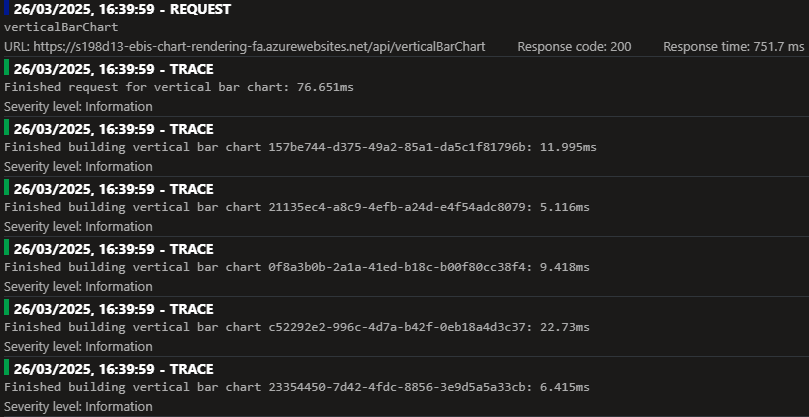

# Performance Test Plan - 0007 - API and Web School Spending and Priorities load tests for SSR charts

**Test run date:**

March/April 2025

## Goal

The goal of this test is to measure the impact of replacing client rendered charts with server side rendered ones.
This includes API, URL and Web tests in order to include coverage over downloaded Web assets.

## Objective

- Establish performance baselines for:
  - typical load conditions using a URL based test on the API directly
  - peak conditions using a URL based test on the API directly
  - peak conditions using a URL based test on the API directly for prolonged time period (soak test)
  - peak conditions using a URL based test on the API directly with an artificial short-lived surge in traffic (spike test)
  - typical load conditions using a URL based test
  - peak conditions using a URL based test
  - typical load conditions using a Web based test
  - peak conditions using a Web based test
- Compare all of the above once [SSR chart spike](https://dfe-ssp.visualstudio.com/s198-DfE-Benchmarking-service/_workitems/edit/248027) is complete
- Compare Web based tests during development of the above in a feature environment (`d13`)

## Procedure

**Determine Capacity:**

Calculate the number of `Virtual Users` required for Azure Load Testing based on a target throughput.

_NB: see previous test plans for calculation._

**Average Load Phase:**

For each endpoint, simulate the typical number of concurrent virtual users to mimic average load conditions over a period of 5 minutes.

**Peak Load Phase:**

For each endpoint, simulate the typical number of concurrent virtual users to mimic peak load conditions over a period of 5 minutes.
Manually scale core database to S2 tier to replicate production infrastucture for the duration of the peak load tests.

**Monitoring Performance:**

- Response Time
  - Definition: The duration between sending a request and receiving a response.
  - Measurement: This will be produced as an output of the test run.
- Error Percentage
  - Definition: The percentage of requests that result in an error response (5xx).
  - Measurement: This will be produced as an output of the test run.
- Throughput
  - Definition: The number of requests processed per second.
  - Measurement: This will be produced as an output of the test run.
- CPU and Memory utilisation
  - Definition: The average percentage utilisation.
  - Measurement: Monitor resource usage to ensure the infrastructure efficiently handles the load.
- Database performance
  - Definition: The average percentage of DTU utilisation.
  - Measurement: Monitor resource usage to ensure the infrastructure efficiently handles the load.

**Pages Under Test:**

| Page                                      | Test Type | Load Type | DB DTUs |
|-------------------------------------------|-----------|-----------|---------|
| `/school/{identifier}/spending-and-costs` | URL       | Average   | S1      |
| `/school/{identifier}/spending-and-costs` | URL       | Peak      | S2      |
| `/school/{identifier}/spending-and-costs` | Web       | Average   | S1      |
| `/school/{identifier}/spending-and-costs` | Web       | Peak      | S2      |

**Endpoints Under Test:**

| Endpoint                     | Load Type       | Target Throughput |
|------------------------------|-----------------|-------------------|
| `POST /api/verticalBarChart` | Average         | 105 /s            |
| `POST /api/verticalBarChart` | Peak/Soak/Spike | 158 /s            |

## API Performance Success Criteria

- Response Time:
  - P50 below 100ms
  - P95 below 150ms
  - P99 below 500ms
- Peak Response Time:
  - P75 below 250ms
  - P95 below 500ms
  - P99 below 1000ms
- Error Rate: below 0.1% *

## Test Execution

### Peak and Average

- Load pattern: Linear
- Test duration (minutes): 6 (60 for soak)
- Ramp-up time (minutes): 1 (5 for soak)

### Soak

- Load pattern: Step
- Test duration (minutes): 60
- Ramp-up steps: 5

### Spike

- Load pattern: Spike
- Test duration (minutes): 10
- Spike multiplier: 10
- Spike hold time (minutes): 1

## Test Output

<!-- take care with final separator line in piped table, as pandoc uses this for relative column widths -->
| Load Test Name                 | Environment & Infrastructure                       | Initiated on         | Max VUs     | Duration | Response time | Errors | Throughput | Result |
|--------------------------------|----------------------------------------------------|----------------------|-------------|----------|---------------|--------|------------|--------|
| Average URL (baseline)         | `t01`                                              | 20/03/2025, 07:06:46 | 15          | 6m       | 320 ms        | 0.01 % | 49.99 /s   | [✅ Passed](https://portal.azure.com/#blade/Microsoft_Azure_CloudNativeTesting/NewReport/resourceId/%2Fsubscriptions%2Fa5c0a8d7-a54d-4a6d-ab79-4ca64a3b750f%2Fresourcegroups%2Fs198t01-ebis-perf-tests%2Fproviders%2Fmicrosoft.loadtestservice%2Floadtests%2Fs198t01-load-tests/testId/64328db8-47e9-4214-9182-b5b7505ff027/testRunId/ffdcb805-e405-4f6b-a735-cbcb90ad7027)     |
| Peak URL (baseline)            | `t01`                                              | 20/03/2025, 10:46:26 | 30          | 6m  5s   | 694 ms        | 0.00 % | 67.49 /s   | [✅ Passed](https://portal.azure.com/#blade/Microsoft_Azure_CloudNativeTesting/NewReport/resourceId/%2Fsubscriptions%2Fa5c0a8d7-a54d-4a6d-ab79-4ca64a3b750f%2Fresourcegroups%2Fs198t01-ebis-perf-tests%2Fproviders%2Fmicrosoft.loadtestservice%2Floadtests%2Fs198t01-load-tests/testId/c661f194-eb06-4513-82fc-a3234deca4ae/testRunId/6a131fd9-7a2e-4b7e-8140-9a9ed9dd96d1)     |
| Average Web (baseline)         | `d13`/`P0v3` Web                                   | 04/04/2025, 11:44:03 | 15          | 5m 2s    | 359 ms        | 0.00 % | 92.53 /s   | [✅ Passed](https://portal.azure.com/#blade/Microsoft_Azure_CloudNativeTesting/NewReport/resourceId/%2Fsubscriptions%2Fa5c0a8d7-a54d-4a6d-ab79-4ca64a3b750f%2Fresourcegroups%2Fs198t01-ebis-perf-tests%2Fproviders%2Fmicrosoft.loadtestservice%2Floadtests%2Fs198t01-load-tests/testId/6a131fd9-7a2e-4b7e-8140-9a9ed9dd9b0b/testRunId/99288980-66a0-4abe-8cf5-a499049f4665)     |
| Peak Web (baseline)            | `d13`/`P0v3` Web                                   | 16/04/2025, 11:42:39 | 30          | 5m 8s    | 679 ms        | 0.00 % | 126.74 /s  | [✅ Passed](https://portal.azure.com/#blade/Microsoft_Azure_CloudNativeTesting/NewReport/resourceId/%2Fsubscriptions%2Fa5c0a8d7-a54d-4a6d-ab79-4ca64a3b750f%2Fresourcegroups%2Fs198t01-ebis-perf-tests%2Fproviders%2Fmicrosoft.loadtestservice%2Floadtests%2Fs198t01-load-tests/testId/1f5453f4-9d9c-4cab-8911-b676df16842a/testRunId/3a7788ae-9a52-46aa-9a32-3905bb2f604d)     |
| Average Web                    | `d13`                                              | 26/03/2025, 15:17:57 | 15          | 4m 59s   | 5.8 s         | 0.00 % | 7.18 /s    | [⚠️ Degraded](https://portal.azure.com/#blade/Microsoft_Azure_CloudNativeTesting/NewReport/resourceId/%2Fsubscriptions%2Fa5c0a8d7-a54d-4a6d-ab79-4ca64a3b750f%2Fresourcegroups%2Fs198t01-ebis-perf-tests%2Fproviders%2Fmicrosoft.loadtestservice%2Floadtests%2Fs198t01-load-tests/testId/6a131fd9-7a2e-4b7e-8140-9a9ed9dd9b0b/testRunId/9489cc8c-f442-4eca-a191-391e02dbc036)  |
| Average Web (logging)          | `d13`                                              | 26/03/2025, 16:34:21 | 15          | 5m 4s    | 5.8 s         | 0.14 % | 7.01 /s    | [❌ Failed](https://portal.azure.com/#blade/Microsoft_Azure_CloudNativeTesting/NewReport/resourceId/%2Fsubscriptions%2Fa5c0a8d7-a54d-4a6d-ab79-4ca64a3b750f%2Fresourcegroups%2Fs198t01-ebis-perf-tests%2Fproviders%2Fmicrosoft.loadtestservice%2Floadtests%2Fs198t01-load-tests/testId/6a131fd9-7a2e-4b7e-8140-9a9ed9dd9b0b/testRunId/9489cc8c-f442-4eca-a191-391e02dbc4e2)     |
| Average Web                    | `d13`/EP1 ASP                                      | 26/03/2025, 16:54:53 | 15          | 5m 3s    | 2.61 s        | 0.00 % | 16.56 /s   | [⚠️ Degraded](https://portal.azure.com/#blade/Microsoft_Azure_CloudNativeTesting/NewReport/resourceId/%2Fsubscriptions%2Fa5c0a8d7-a54d-4a6d-ab79-4ca64a3b750f%2Fresourcegroups%2Fs198t01-ebis-perf-tests%2Fproviders%2Fmicrosoft.loadtestservice%2Floadtests%2Fs198t01-load-tests/testId/6a131fd9-7a2e-4b7e-8140-9a9ed9dd9b0b/testRunId/9489cc8c-f442-4eca-a191-391e02dbc820)  |
| Peak Web                       | `d13`                                              | 26/03/2025, 15:28:06 | 30          | 5m       | 10.5 s        | 0.00 % | 7.73 /s    | [⚠️ Degraded](https://portal.azure.com/#blade/Microsoft_Azure_CloudNativeTesting/NewReport/resourceId/%2Fsubscriptions%2Fa5c0a8d7-a54d-4a6d-ab79-4ca64a3b750f%2Fresourcegroups%2Fs198t01-ebis-perf-tests%2Fproviders%2Fmicrosoft.loadtestservice%2Floadtests%2Fs198t01-load-tests/testId/1f5453f4-9d9c-4cab-8911-b676df16842a/testRunId/9489cc8c-f442-4eca-a191-391e02dbc233)  |
| Average Web (ssr enabled)      | `d13`/`P0v3` Web                                   | 01/04/2025, 16:15:58 | 15          | 5m 6s    | 1.69 s        | 0.00 % | 27.27 /s   | [⚠️ Degraded](https://portal.azure.com/#blade/Microsoft_Azure_CloudNativeTesting/NewReport/resourceId/%2Fsubscriptions%2Fa5c0a8d7-a54d-4a6d-ab79-4ca64a3b750f%2Fresourcegroups%2Fs198t01-ebis-perf-tests%2Fproviders%2Fmicrosoft.loadtestservice%2Floadtests%2Fs198t01-load-tests/testId/6a131fd9-7a2e-4b7e-8140-9a9ed9dd9b0b/testRunId/1dbf0f3b-009a-4472-aa8f-972105af4297)  |
| Average Web (ssr enabled)      | `d13`/ `P0v3` Web/`EP1` ASP                        | 01/04/2025, 16:34:42 | 15          | 5m 2s    | 2.55 s        | 0.00 % | 15.57 /s   | [⚠️ Degraded](https://portal.azure.com/#blade/Microsoft_Azure_CloudNativeTesting/NewReport/resourceId/%2Fsubscriptions%2Fa5c0a8d7-a54d-4a6d-ab79-4ca64a3b750f%2Fresourcegroups%2Fs198t01-ebis-perf-tests%2Fproviders%2Fmicrosoft.loadtestservice%2Floadtests%2Fs198t01-load-tests/testId/6a131fd9-7a2e-4b7e-8140-9a9ed9dd9b0b/testRunId/1dbf0f3b-009a-4472-aa8f-972105af4297)  |
| Average API                    | `d13`/`EP1` ASP                                    | 02/04/2025, 11:17:29 | 5           | 5m 55s   | 241 ms        | 0.00 % | 35.50 /s   | [❌ Failed](https://portal.azure.com/#blade/Microsoft_Azure_CloudNativeTesting/NewReport/resourceId/%2Fsubscriptions%2Fa5c0a8d7-a54d-4a6d-ab79-4ca64a3b750f%2Fresourcegroups%2Fs198t01-ebis-perf-tests%2Fproviders%2Fmicrosoft.loadtestservice%2Floadtests%2Fs198t01-load-tests/testId/323ec97f-7ef8-4035-b0e7-85dbd6f8a0eb/testRunId/d0183981-0b55-4b03-b84d-547a477a7bcc)     |
| Average API (worker pool)      | `d13`/`EP1` ASP                                    | 02/04/2025, 14:08:48 | 5           | 5m 55s   | 256 ms        | 0.02 % | 29.21 /s   | [❌ Failed](https://portal.azure.com/#blade/Microsoft_Azure_CloudNativeTesting/NewReport/resourceId/%2Fsubscriptions%2Fa5c0a8d7-a54d-4a6d-ab79-4ca64a3b750f%2Fresourcegroups%2Fs198t01-ebis-perf-tests%2Fproviders%2Fmicrosoft.loadtestservice%2Floadtests%2Fs198t01-load-tests/testId/323ec97f-7ef8-4035-b0e7-85dbd6f8a0eb/testRunId/07f703c0-c9ef-4af3-b853-6d2f45f0901b)     |
| Average API (worker pool)      | `d13`/`EP1` ASP/`10` app worker count              | 02/04/2025, 14:20:48 | 5           | 5m 56s   | 155 ms        | 0.00 % | 27.41 /s   | [❌ Failed](https://portal.azure.com/#blade/Microsoft_Azure_CloudNativeTesting/NewReport/resourceId/%2Fsubscriptions%2Fa5c0a8d7-a54d-4a6d-ab79-4ca64a3b750f%2Fresourcegroups%2Fs198t01-ebis-perf-tests%2Fproviders%2Fmicrosoft.loadtestservice%2Floadtests%2Fs198t01-load-tests/testId/323ec97f-7ef8-4035-b0e7-85dbd6f8a0eb/testRunId/07f703c0-c9ef-4af3-b853-6d2f45f0925c)     |
| Average API (worker per chart) | `d13`/`EP1` ASP                                    | 02/04/2025, 14:58:07 | 5           | 5m 49s   | 340 ms        | 0.00 % | 16.40 /s   | [❌ Failed](https://portal.azure.com/#blade/Microsoft_Azure_CloudNativeTesting/NewReport/resourceId/%2Fsubscriptions%2Fa5c0a8d7-a54d-4a6d-ab79-4ca64a3b750f%2Fresourcegroups%2Fs198t01-ebis-perf-tests%2Fproviders%2Fmicrosoft.loadtestservice%2Floadtests%2Fs198t01-load-tests/testId/323ec97f-7ef8-4035-b0e7-85dbd6f8a0eb/testRunId/07f703c0-c9ef-4af3-b853-6d2f45f095ad)     |
| Average API (XMLDOM)           | `d13`/`EP1`, 50 burst ASP/`10` instance            | 03/04/2025, 09:48:33 | 2 + 2       | 5m 33s   | 40 ms         | 0.00 % | 162.03 /s  | [✅ Passed](https://portal.azure.com/#blade/Microsoft_Azure_CloudNativeTesting/NewReport/resourceId/%2Fsubscriptions%2Fa5c0a8d7-a54d-4a6d-ab79-4ca64a3b750f%2Fresourcegroups%2Fs198t01-ebis-perf-tests%2Fproviders%2Fmicrosoft.loadtestservice%2Floadtests%2Fs198t01-load-tests/testId/323ec97f-7ef8-4035-b0e7-85dbd6f8a0eb/testRunId/ac6d0ead-aeff-48bc-a09a-5533ee2d2047)     |
| Average API                    | `d13`/`EP1`, 50 burst ASP/`2` instance             | 03/04/2025, 12:37:53 | 2 + 2       | 5m 37s   | 38 ms         | 0.00 % | 172.0 /s   | [✅ Passed](https://portal.azure.com/#blade/Microsoft_Azure_CloudNativeTesting/NewReport/resourceId/%2Fsubscriptions%2Fa5c0a8d7-a54d-4a6d-ab79-4ca64a3b750f%2Fresourcegroups%2Fs198t01-ebis-perf-tests%2Fproviders%2Fmicrosoft.loadtestservice%2Floadtests%2Fs198t01-load-tests/testId/323ec97f-7ef8-4035-b0e7-85dbd6f8a0eb/testRunId/e9e6bd04-c6ce-4796-8deb-0310ea46c020)     |
| Average API                    | `d13`/`EP1`, 50 burst ASP/`1` instance             | 03/04/2025, 12:48:41 | 2 + 2       | 5m 41s   | 41 ms         | 0.00 % | 145.14 /s  | [✅ Passed](https://portal.azure.com/#blade/Microsoft_Azure_CloudNativeTesting/NewReport/resourceId/%2Fsubscriptions%2Fa5c0a8d7-a54d-4a6d-ab79-4ca64a3b750f%2Fresourcegroups%2Fs198t01-ebis-perf-tests%2Fproviders%2Fmicrosoft.loadtestservice%2Floadtests%2Fs198t01-load-tests/testId/323ec97f-7ef8-4035-b0e7-85dbd6f8a0eb/testRunId/e9e6bd04-c6ce-4796-8deb-0310ea46c020)     |
| Average API                    | `d13`/`EP1`, 10 burst ASP/`1` instance             | 15/04/2025, 05:49:19 | 2 + 2       | 5m 39s   | 77 ms         | 0.00 % | 82.88 /s   | [✅ Passed](https://portal.azure.com/#blade/Microsoft_Azure_CloudNativeTesting/NewReport/resourceId/%2Fsubscriptions%2Fa5c0a8d7-a54d-4a6d-ab79-4ca64a3b750f%2Fresourcegroups%2Fs198t01-ebis-perf-tests%2Fproviders%2Fmicrosoft.loadtestservice%2Floadtests%2Fs198t01-load-tests/testId/323ec97f-7ef8-4035-b0e7-85dbd6f8a0eb/testRunId/4a3eead5-dba4-4431-bb09-1288e83dc01d)     |
| Average API                    | `d13`/`Y1` ASP                                     | 04/04/2025, 10:29:04 | 2 + 2       | 5m 31s   | 73 ms         | 0.00 % | 88.08 /s   | [✅ Passed](https://portal.azure.com/#blade/Microsoft_Azure_CloudNativeTesting/NewReport/resourceId/%2Fsubscriptions%2Fa5c0a8d7-a54d-4a6d-ab79-4ca64a3b750f%2Fresourcegroups%2Fs198t01-ebis-perf-tests%2Fproviders%2Fmicrosoft.loadtestservice%2Floadtests%2Fs198t01-load-tests/testId/323ec97f-7ef8-4035-b0e7-85dbd6f8a0eb/testRunId/bdf20775-48bc-45ff-a01c-1d788503f020)     |
| Peak API                       | `d13`/`EP1`, 50 burst ASP/`10` instance            | 03/04/2025, 10:34:29 | 5 + 5       | 5m 53s   | 65 ms         | 0.00 % | 248.93 /s  | [✅ Passed](https://portal.azure.com/#blade/Microsoft_Azure_CloudNativeTesting/NewReport/resourceId/%2Fsubscriptions%2Fa5c0a8d7-a54d-4a6d-ab79-4ca64a3b750f%2Fresourcegroups%2Fs198t01-ebis-perf-tests%2Fproviders%2Fmicrosoft.loadtestservice%2Floadtests%2Fs198t01-load-tests/testId/9bb3b42b-c2c2-4489-a85e-bf0cfdb9800e/testRunId/9bb3b42b-c2c2-4489-a85e-bf0cfdb982cf)     |
| Peak API                       | `d13`/`EP1`, 50 burst ASP/`1` instance             | 03/04/2025, 13:17:17 | 5 + 5       | 5m 49s   | 78 ms         | 0.00 % | 217.79 /s  | [✅ Passed](https://portal.azure.com/#blade/Microsoft_Azure_CloudNativeTesting/NewReport/resourceId/%2Fsubscriptions%2Fa5c0a8d7-a54d-4a6d-ab79-4ca64a3b750f%2Fresourcegroups%2Fs198t01-ebis-perf-tests%2Fproviders%2Fmicrosoft.loadtestservice%2Floadtests%2Fs198t01-load-tests/testId/9bb3b42b-c2c2-4489-a85e-bf0cfdb9800e/testRunId/e9e6bd04-c6ce-4796-8deb-0310ea46c59a)     |
| Peak API                       | `d13`/`EP1`, 10 burst ASP/`1` instance             | 15/04/2025, 12:10:01 | 5 + 5       | 5m 48s   | 81 ms         | 0.00 % | 173.65 /s  | [✅ Passed](https://portal.azure.com/#blade/Microsoft_Azure_CloudNativeTesting/NewReport/resourceId/%2Fsubscriptions%2Ff155d7d4-a235-4563-b077-c19686c7c92a%2Fresourcegroups%2Fs198d13-ebis-support%2Fproviders%2Fmicrosoft.loadtestservice%2Floadtests%2Fs198d13-load-tests-manual/testId/161b5781-34f4-4a8d-b495-c10d71ccf00b/testRunId/161b5781-34f4-4a8d-b495-c10d71ccf031) |
| Peak API                       | `d13`/`Y1` ASP                                     | 04/04/2025, 10:47:06 | 5 + 5       | 5m 48s   | 118 ms        | 0.00 % | 171.79 /s  | [✅ Passed](https://portal.azure.com/#blade/Microsoft_Azure_CloudNativeTesting/NewReport/resourceId/%2Fsubscriptions%2Fa5c0a8d7-a54d-4a6d-ab79-4ca64a3b750f%2Fresourcegroups%2Fs198t01-ebis-perf-tests%2Fproviders%2Fmicrosoft.loadtestservice%2Floadtests%2Fs198t01-load-tests/testId/9bb3b42b-c2c2-4489-a85e-bf0cfdb9800e/testRunId/76acaa0e-b37a-4094-a86f-c76fd2578031)     |
| Soak API                       | `d13`/`EP1`, 10 burst ASP/`1` instance             | 15/04/2025, 12:30:14 | 5 + 5       | 1hr 2s   | 72 ms         | 0.00 % | 236.75 /s  | [✅ Passed](https://portal.azure.com/#blade/Microsoft_Azure_CloudNativeTesting/NewReport/resourceId/%2Fsubscriptions%2Ff155d7d4-a235-4563-b077-c19686c7c92a%2Fresourcegroups%2Fs198d13-ebis-support%2Fproviders%2Fmicrosoft.loadtestservice%2Floadtests%2Fs198d13-load-tests-manual/testId/161b5781-34f4-4a8d-b495-c10d71ccf00b/testRunId/161b5781-34f4-4a8d-b495-c10d71ccf031) |
| Soak API                       | `d13`/`Y1` ASP                                     | 15/04/2025, 16:20:56 | 5 + 5       | 1hr 2s   | 118 ms        | 0.00 % | 141.80 /s  | [✅ Passed](https://portal.azure.com/#blade/Microsoft_Azure_CloudNativeTesting/NewReport/resourceId/%2Fsubscriptions%2Ff155d7d4-a235-4563-b077-c19686c7c92a%2Fresourcegroups%2Fs198d13-ebis-support%2Fproviders%2Fmicrosoft.loadtestservice%2Floadtests%2Fs198d13-load-tests-manual/testId/161b5781-34f4-4a8d-b495-c10d71ccf00b/testRunId/00d67278-9ac8-46f2-9d9b-612426a9c02b) |
| Spike API                      | `d13`/`EP1`, 10 burst ASP/`1` instance             | 15/04/2025, 14:49:33 | 5 + 5 (x5)  | 10m 1s   | 95 ms         | 0.00 % | 159.86 /s  | [✅ Passed](https://portal.azure.com/#blade/Microsoft_Azure_CloudNativeTesting/NewReport/resourceId/%2Fsubscriptions%2Fa5c0a8d7-a54d-4a6d-ab79-4ca64a3b750f%2Fresourcegroups%2Fs198t01-ebis-perf-tests%2Fproviders%2Fmicrosoft.loadtestservice%2Floadtests%2Fs198t01-load-tests/testId/734cbbd4-7613-4980-a8cb-d8124423000e/testRunId/734cbbd4-7613-4980-a8cb-d81244230052)     |
| Spike API                      | `d13`/`EP1`, 10 burst ASP/`1` instance             | 15/04/2025, 15:06:15 | 5 + 5 (x10) | 10m 8s   | 81 ms         | 0.00 % | 210.29 /s  | [✅ Passed](https://portal.azure.com/#blade/Microsoft_Azure_CloudNativeTesting/NewReport/resourceId/%2Fsubscriptions%2Fa5c0a8d7-a54d-4a6d-ab79-4ca64a3b750f%2Fresourcegroups%2Fs198t01-ebis-perf-tests%2Fproviders%2Fmicrosoft.loadtestservice%2Floadtests%2Fs198t01-load-tests/testId/734cbbd4-7613-4980-a8cb-d8124423000e/testRunId/4e5d6cfb-754c-4316-8d66-dbdcb36ef051)     |
| Spike API                      | `d13`/`Y1` ASP                                     | 15/04/2025, 16:05:04 | 5 + 5 (x10) | 10m 6s   | 145 ms        | 0.00 % | 110.49 /s  | [✅ Passed](https://portal.azure.com/#blade/Microsoft_Azure_CloudNativeTesting/NewReport/resourceId/%2Fsubscriptions%2Fa5c0a8d7-a54d-4a6d-ab79-4ca64a3b750f%2Fresourcegroups%2Fs198t01-ebis-perf-tests%2Fproviders%2Fmicrosoft.loadtestservice%2Floadtests%2Fs198t01-load-tests/testId/734cbbd4-7613-4980-a8cb-d8124423000e/testRunId/a1421ceb-a3fa-44cc-8ddb-b09158bec930)     |
| Average Web                    | `d13`/`P0v3` Web/`EP1`, 50 burst ASP/`10` instance | 03/04/2025, 09:56:42 | 15          | 5m 9s    | 430 ms        | 0.00 % | 85.19 /s   | [✅ Passed](https://portal.azure.com/#blade/Microsoft_Azure_CloudNativeTesting/NewReport/resourceId/%2Fsubscriptions%2Fa5c0a8d7-a54d-4a6d-ab79-4ca64a3b750f%2Fresourcegroups%2Fs198t01-ebis-perf-tests%2Fproviders%2Fmicrosoft.loadtestservice%2Floadtests%2Fs198t01-load-tests/testId/6a131fd9-7a2e-4b7e-8140-9a9ed9dd9b0b/testRunId/ac6d0ead-aeff-48bc-a09a-5533ee2d22ed)     |
| Average Web                    | `d13`/`P0v3` Web/`EP1`, 50 burst ASP/`1` instance  | 03/04/2025, 13:42:07 | 15          | 5m 3s    | 610 ms        | 0.00 % | 55.35 /s   | [✅ Passed](https://portal.azure.com/#blade/Microsoft_Azure_CloudNativeTesting/NewReport/resourceId/%2Fsubscriptions%2Fa5c0a8d7-a54d-4a6d-ab79-4ca64a3b750f%2Fresourcegroups%2Fs198t01-ebis-perf-tests%2Fproviders%2Fmicrosoft.loadtestservice%2Floadtests%2Fs198t01-load-tests/testId/6a131fd9-7a2e-4b7e-8140-9a9ed9dd9b0b/testRunId/e9e6bd04-c6ce-4796-8deb-0310ea46cdba)     |
| Average Web                    | `d13`/`P0v3` Web/`EP1`, 10 burst ASP/`1` instance  | 16/04/2025, 11:25:40 | 15          | 5m       | 494 ms        | 0.01 % | 74.49 /s   | [✅ Passed](https://portal.azure.com/#blade/Microsoft_Azure_CloudNativeTesting/NewReport/resourceId/%2Fsubscriptions%2Fa5c0a8d7-a54d-4a6d-ab79-4ca64a3b750f%2Fresourcegroups%2Fs198t01-ebis-perf-tests%2Fproviders%2Fmicrosoft.loadtestservice%2Floadtests%2Fs198t01-load-tests/testId/6a131fd9-7a2e-4b7e-8140-9a9ed9dd9b0b/testRunId/8839fcdc-29ea-4f7f-822f-70c0b41860b2)     |
| Average Web                    | `d13`/`P0v3` Web/`Y1` ASP                          | 04/04/2025, 11:00:14 | 15          | 5m 7s    | 441 ms        | 0.00 % | 86.85 /s   | [✅ Passed](https://portal.azure.com/#blade/Microsoft_Azure_CloudNativeTesting/NewReport/resourceId/%2Fsubscriptions%2Fa5c0a8d7-a54d-4a6d-ab79-4ca64a3b750f%2Fresourcegroups%2Fs198t01-ebis-perf-tests%2Fproviders%2Fmicrosoft.loadtestservice%2Floadtests%2Fs198t01-load-tests/testId/6a131fd9-7a2e-4b7e-8140-9a9ed9dd9b0b/testRunId/76acaa0e-b37a-4094-a86f-c76fd25781a5)     |
| Peak Web                       | `d13`/`P0v3` Web/`EP1`, 50 burst ASP/`10` instance | 03/04/2025, 10:41:16 | 30          | 5m 1s    | 837 ms        | 0.00 % | 94.61 /s   | [✅ Passed](https://portal.azure.com/#blade/Microsoft_Azure_CloudNativeTesting/NewReport/resourceId/%2Fsubscriptions%2Fa5c0a8d7-a54d-4a6d-ab79-4ca64a3b750f%2Fresourcegroups%2Fs198t01-ebis-perf-tests%2Fproviders%2Fmicrosoft.loadtestservice%2Floadtests%2Fs198t01-load-tests/testId/1f5453f4-9d9c-4cab-8911-b676df16842a/testRunId/9bb3b42b-c2c2-4489-a85e-bf0cfdb98481)     |
| Peak Web                       | `d13`/`P0v3` Web/`EP1`, 50 burst ASP/`1` instance  | 03/04/2025, 14:07:51 | 30          | 5m 3s    | 1.06 s        | 0.00 % | 66.34 /s   | [✅ Passed](https://portal.azure.com/#blade/Microsoft_Azure_CloudNativeTesting/NewReport/resourceId/%2Fsubscriptions%2Fa5c0a8d7-a54d-4a6d-ab79-4ca64a3b750f%2Fresourcegroups%2Fs198t01-ebis-perf-tests%2Fproviders%2Fmicrosoft.loadtestservice%2Floadtests%2Fs198t01-load-tests/testId/1f5453f4-9d9c-4cab-8911-b676df16842a/testRunId/24f9a848-dc3b-48f6-ae43-d07db7f59025)     |
| Peak Web                       | `d13`/`P0v3` Web/`EP1`, 10 burst ASP/`1` instance  | 16/04/2025, 11:13:02 | 30          | 5m 2s    | 691 ms        | 0.00 % | 115.30 /s  | [✅ Passed](https://portal.azure.com/#blade/Microsoft_Azure_CloudNativeTesting/NewReport/resourceId/%2Fsubscriptions%2Fa5c0a8d7-a54d-4a6d-ab79-4ca64a3b750f%2Fresourcegroups%2Fs198t01-ebis-perf-tests%2Fproviders%2Fmicrosoft.loadtestservice%2Floadtests%2Fs198t01-load-tests/testId/1f5453f4-9d9c-4cab-8911-b676df16842a/testRunId/73e1c6e2-a2c7-4e7d-a11c-15d1fd92c180)     |
| Peak Web                       | `d13`/`P0v3` Web/`Y1` ASP                          | 04/04/2025, 11:10:40 | 30          | 5m       | 839 ms        | 0.00 % | 95.42 /s   | [✅ Passed](https://portal.azure.com/#blade/Microsoft_Azure_CloudNativeTesting/NewReport/resourceId/%2Fsubscriptions%2Fa5c0a8d7-a54d-4a6d-ab79-4ca64a3b750f%2Fresourcegroups%2Fs198t01-ebis-perf-tests%2Fproviders%2Fmicrosoft.loadtestservice%2Floadtests%2Fs198t01-load-tests/testId/1f5453f4-9d9c-4cab-8911-b676df16842a/testRunId/99288980-66a0-4abe-8cf5-a499049f4072)     |

**Findings and Recommendations:**

Significant degredation under load when rendering charts server side. The two peaks below are from the average and then the peak load against `d13` respectively. The bottleneck may be seen to be with the requests to the new function app, although not the actual chart generation or function itself which seems quite performant.

After moving to Elastic Plan 1 performance was improved, but still around 50% worse than the pre-SSR load test run (average load):

After moving the Web service plan to match that in `t01` (`P0v3`) there were definite improvements, but the results were till not acceptable. This in combination with EP1 on the function app actually seemed to reduce performance under some configurations.

When running the API tests directly, however, when the Elastic plan was tweaked performance was greatly improved. This was especially with the usage of [xmldom](https://www.npmjs.com/package/@xmldom/xmldom) instead of [jsdom](https://www.npmjs.com/package/jsdom) along with [worker_threads](https://nodejs.org/api/worker_threads.html) pooling.

| Run           | Load    | API Infrastructure            | Date | Response time | Throughput |
|---------------|---------|-------------------------------|------|---------------|------------|
| Baseline      | Average |                               | [04/04/2025, 11:44:03](https://portal.azure.com/#blade/Microsoft_Azure_CloudNativeTesting/NewReport/resourceId/%2Fsubscriptions%2Fa5c0a8d7-a54d-4a6d-ab79-4ca64a3b750f%2Fresourcegroups%2Fs198t01-ebis-perf-tests%2Fproviders%2Fmicrosoft.loadtestservice%2Floadtests%2Fs198t01-load-tests/testId/6a131fd9-7a2e-4b7e-8140-9a9ed9dd9b0b/testRunId/99288980-66a0-4abe-8cf5-a499049f4665) | 359 ms        | 92.53 /s   |
| SSR d3 charts | Average | `EP1` / 50 burst / 1 warm     | [03/04/2025, 13:42:07](https://portal.azure.com/#blade/Microsoft_Azure_CloudNativeTesting/NewReport/resourceId/%2Fsubscriptions%2Fa5c0a8d7-a54d-4a6d-ab79-4ca64a3b750f%2Fresourcegroups%2Fs198t01-ebis-perf-tests%2Fproviders%2Fmicrosoft.loadtestservice%2Floadtests%2Fs198t01-load-tests/testId/6a131fd9-7a2e-4b7e-8140-9a9ed9dd9b0b/testRunId/e9e6bd04-c6ce-4796-8deb-0310ea46cdba) | 610 ms        | 55.35 /s   |
| SSR d3 charts | Average | **`EP1` / 10 burst / 1 warm** | [16/04/2025, 11:25:40](https://portal.azure.com/#blade/Microsoft_Azure_CloudNativeTesting/NewReport/resourceId/%2Fsubscriptions%2Fa5c0a8d7-a54d-4a6d-ab79-4ca64a3b750f%2Fresourcegroups%2Fs198t01-ebis-perf-tests%2Fproviders%2Fmicrosoft.loadtestservice%2Floadtests%2Fs198t01-load-tests/testId/6a131fd9-7a2e-4b7e-8140-9a9ed9dd9b0b/testRunId/8839fcdc-29ea-4f7f-822f-70c0b41860b2) | 494 ms        | 74.49 /s   |
| SSR d3 charts | Average | `Y1`                          | [04/04/2025, 11:00:14](https://portal.azure.com/#blade/Microsoft_Azure_CloudNativeTesting/NewReport/resourceId/%2Fsubscriptions%2Fa5c0a8d7-a54d-4a6d-ab79-4ca64a3b750f%2Fresourcegroups%2Fs198t01-ebis-perf-tests%2Fproviders%2Fmicrosoft.loadtestservice%2Floadtests%2Fs198t01-load-tests/testId/6a131fd9-7a2e-4b7e-8140-9a9ed9dd9b0b/testRunId/76acaa0e-b37a-4094-a86f-c76fd25781a5) | 441 ms        | 86.85 /s   |
| Baseline      | Peak    |                               | [16/04/2025, 11:42:39](https://portal.azure.com/#blade/Microsoft_Azure_CloudNativeTesting/NewReport/resourceId/%2Fsubscriptions%2Fa5c0a8d7-a54d-4a6d-ab79-4ca64a3b750f%2Fresourcegroups%2Fs198t01-ebis-perf-tests%2Fproviders%2Fmicrosoft.loadtestservice%2Floadtests%2Fs198t01-load-tests/testId/1f5453f4-9d9c-4cab-8911-b676df16842a/testRunId/3a7788ae-9a52-46aa-9a32-3905bb2f604d) | 679 ms        | 126.74 /s  |
| SSR d3 charts | Peak    | `EP1` / 50 burst / 1 warm     | [03/04/2025, 14:07:51](https://portal.azure.com/#blade/Microsoft_Azure_CloudNativeTesting/NewReport/resourceId/%2Fsubscriptions%2Fa5c0a8d7-a54d-4a6d-ab79-4ca64a3b750f%2Fresourcegroups%2Fs198t01-ebis-perf-tests%2Fproviders%2Fmicrosoft.loadtestservice%2Floadtests%2Fs198t01-load-tests/testId/1f5453f4-9d9c-4cab-8911-b676df16842a/testRunId/24f9a848-dc3b-48f6-ae43-d07db7f59025) | 1.06 s        | 66.34 /s   |
| SSR d3 charts | Peak    | **`EP1` / 10 burst / 1 warm** | [16/04/2025, 11:13:02](https://portal.azure.com/#blade/Microsoft_Azure_CloudNativeTesting/NewReport/resourceId/%2Fsubscriptions%2Fa5c0a8d7-a54d-4a6d-ab79-4ca64a3b750f%2Fresourcegroups%2Fs198t01-ebis-perf-tests%2Fproviders%2Fmicrosoft.loadtestservice%2Floadtests%2Fs198t01-load-tests/testId/1f5453f4-9d9c-4cab-8911-b676df16842a/testRunId/73e1c6e2-a2c7-4e7d-a11c-15d1fd92c180) | 691 ms        | 115.30 /s  |
| SSR d3 charts | Peak    | `Y1`                          | [04/04/2025, 11:10:40](https://portal.azure.com/#blade/Microsoft_Azure_CloudNativeTesting/NewReport/resourceId/%2Fsubscriptions%2Fa5c0a8d7-a54d-4a6d-ab79-4ca64a3b750f%2Fresourcegroups%2Fs198t01-ebis-perf-tests%2Fproviders%2Fmicrosoft.loadtestservice%2Floadtests%2Fs198t01-load-tests/testId/1f5453f4-9d9c-4cab-8911-b676df16842a/testRunId/99288980-66a0-4abe-8cf5-a499049f4072) | 839 ms        | 95.42 /s   |

As part of the Soak API test, a requirement for monitoring CPU and Memory usage was required, which produced the following acceptable results with `EP1` (performance metrics are [not available](https://learn.microsoft.com/en-us/azure/azure-functions/monitor-functions?tabs=portal#azure-monitor-platform-metrics) with Linux consumption plans):

These performance metric can also be seen split amongst the (up to) 10 burst instances in the elastic app service plan:

As part of the Spike API test, a requirement for monitoring the recovery of worker instances was required, which returned the following acceptable results with `EP1`:

The equivalent results when using `Y1` were:

<!-- Leave the rest of this page blank -->
\newpage
