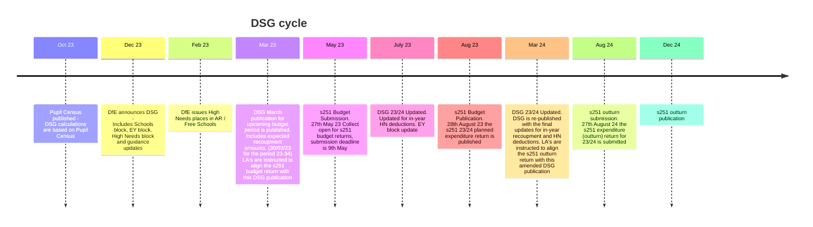

# Dedicated Schools Grant (DSG)

The Dedicated Schools Grant (DSG) provides revenue funding for local authorities, to support expenditure on schools, early years and children and young people with high needs. The grant is made under section 14 of the Education Act 2002.  The grant is paid in to local authorities to support the schools budget it is the main source of income for the schools.

Local authorities are responsible for determining the split of the grant between central expenditure and the individual schools budget (ISB) in conjunction with local schools forums. Local authorities are responsible for allocating the ISB to individual schools in accordance with the local schools’ funding formula.  

The DSG is made oup of 4 distinct blocks of funding, each using different methods of calculating the awarded amount and each to be used for specific purposes.

## DSG Blocks

### Schools Block

The majority of the Schools Block is allocated to individual primary and 
secondary school budgets to pay for children and young people’s education 
according to the National Funding Formula (NFF).

The Primary Unit of Funding (PUFs) for each local authority are multiplied by:

- the number of pupils in reception to year group 6 from the October 2023 school census plus
- pupils aged 4 to 10 not assigned to a year group from the October 2023 school census

The Secondary Unit of Funding (SUFs) for each local authority are multiplied by:

- the number of pupils in year groups 7 to 11 from the October 2023 school census plus
- pupils aged 11 to 15 not assigned to a year group from the October 2023 school census

*PUF and SUF values are calculated using the NFF and give a per pupil amount which takes into account 13 factors e.g. location of LA, health, population

### High Needs Block

Is comprised of 2 main components-

<strong>Place funding for High Needs</strong>.  Place funding is allocated as an annual amount of core high needs funding for schools and colleges. Place funding is allocated at a standard rate for a number of places, reflecting the number of high needs placements which commissioning local authorities expect to make in the coming year.  The funded amount is currently set at £6000 or £10000, depending on the type of place.

<strong>Top up funding</strong> is the funding required over and above the place funding a school or college receives to enable a pupil or student with high needs to participate in education and learning. This is paid by the commissioning local authority (or sometimes schools in the case of AP) and should reflect the costs of additional support to meet the individual pupil or student’s needs.

### Early Years Block

Early Years funding (to pay for the education of 2-3 year olds) is calculated using 4 criteria

- Funding for the free early years childcare entitlements
- Early years pupil premium (EYPP)
- Early years disability access fund (DAF)
- Early years supplementary funding or maintained nursery schools

### Central Schools Services Block

The CSSB provides funding for local authorities to carry out central functions on behalf of maintained schools and academies, comprising 2 distinct elements
It is calculated by multiplying the CSSB units of funding by the number of pupils recorded in the October 2023 school census: in reception to year group 11, and aged 4 to 15 not assigned to a year group

## DSG Timeline

The following is a high level timeline of significant events in the DSG cycle, the dates used are illustrative and are from the 23/24 DSG period

## Use of DSG in FBIT

Given that the DSG iss the principal source of funding for schools it is used by Local Authorities to determine the amount that each school can spend in an academic year and is therefore used to set the school budget.  The value will be used in the FBIT service to compare to the actual amount spent by schools in each local authority to benchmark the alignment to the DSG.

### Data Source

As shown in the timeline above the DSG is published at several points through the reporting cycle.  2 of the publications will be ingested into FBIT to align with the s251 datasets, these will the early March variant (start of period version) and the late March version at the end of the period i.e. end of March in the following calendar year.

<strong>Publication site</strong>

https://skillsfunding.service.gov.uk/view-latest-funding/national-funding-allocations/DSG/2025-to-2026