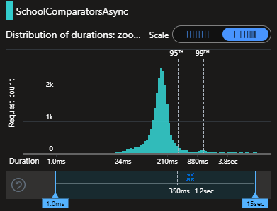
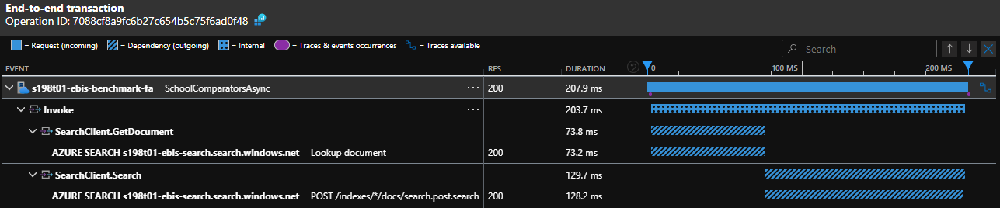

# Performance Test Plan - 0002 - API Peak Load

**Test run date:**

September 2024

## Goal

The goal of this test is to measure how well the APIs perform under peak load conditions. Focus will be on verifying the
high demand and critical endpoints.

## Objective

- Ensure that the APIs remains stable without crashes or timeouts during peak usage.
- Confirm that the APIs do not degrade significantly, and maintain performance, during expected high-traffic periods.
- Validate capacity during anticipated peak load.

## Procedure

**Determine Capacity:**

Calculate the number of `Virtual Users` required for Azure Load Testing based on a target throughput.

_NB: see previous test plans for calculation._

**Average Load Phase:**

For each endpoint, simulate the typical number of concurrent virtual users to mimic peak load conditions over a
period of 5 minutes.

**Monitoring Performance:**

- Response Time
  - Definition: The duration between sending a request to the API and receiving a response.
  - Measurement: This will be produced as an output of the test run.
- Error Percentage
  - Definition: The percentage of API requests that result in an error response (5xx).
  - Measurement: This will be produced as an output of the test run.
- Throughput
  - Definition: The number of API requests processed per second.
  - Measurement: This will be produced as an output of the test run.

**APIs & Endpoints Under Test:**

| API           | Endpoint                                   | Target Throughput |
|---------------|--------------------------------------------|-------------------|
| Establishment | `POST /school/suggest`                     | 113 /s            |
| Establishment | `GET /school/{identifier}`                 | 113 /s            |
| Benchmark     | `GET /user-data`                           | 113 /s            |
| Benchmark     | `POST /comparators/schools`                | 113 /s            |
| Benchmark     | `GET /comparator-set/school/{urn}/default` | 113 /s            |
| Insights      | `GET /school/{urn}/characteristics`        | 158 /s            |
| Insights      | `GET /expenditure/school/{urn}`            | 158 /s            |
| Insights      | `GET /metric-rag/default`                  | 158 /s            |

## Performance Success Criteria

- Response Time:
  - P75 below 200ms
  - P95 below 300ms
  - P99 below 500ms
- Error Rate:  below 1%

## Test Execution

- Load pattern: Linear
- Test duration (minutes): 6
- Ramp-up time (minutes): 1

## Test Output

**Summary Report:**

<!-- take care with final separator line in piped table, as pandoc uses this for relative column widths -->
| Load Test Name                             | Initiated on             | Max VUs | Duration   | Response time | Errors     | Throughput    | Result      |
|--------------------------------------------|--------------------------|---------|------------|---------------|------------|---------------|-------------|
| Establishment API - Suggest Schools        | 09/09/2024, 08:39:37     | 7       | 5m 53s     | 81 ms         | 0 %        | 108.69 /s     | [✅ Passed](https://portal.azure.com/#blade/Microsoft_Azure_CloudNativeTesting/NewReport/resourceId/%2Fsubscriptions%2Fa5c0a8d7-a54d-4a6d-ab79-4ca64a3b750f%2Fresourcegroups%2Fs198t01-ebis-perf-tests%2Fproviders%2Fmicrosoft.loadtestservice%2Floadtests%2Fs198t01-load-tests/testId/0dc8462e-6609-4fe9-aea4-eeb1a40ce1bc/testRunId/2b3d5e5f-5af0-424a-a5c0-acc5250763af) 1️⃣         |
| Establishment API - Get Schools            | 06/09/2024, 12:52:58     | 3       | 5m 48s     | 21 ms         | 0 %        | 132.35 /s     | [✅ Passed](https://portal.azure.com/#blade/Microsoft_Azure_CloudNativeTesting/NewReport/resourceId/%2Fsubscriptions%2Fa5c0a8d7-a54d-4a6d-ab79-4ca64a3b750f%2Fresourcegroups%2Fs198t01-ebis-perf-tests%2Fproviders%2Fmicrosoft.loadtestservice%2Floadtests%2Fs198t01-load-tests/testId/0dc8462e-6609-4fe9-aea4-eeb1a40ce12d/testRunId/0dc8462e-6609-4fe9-aea4-eeb1a40ce14a)         |
| Benchmark API - Get User Data              | 09/09/2024, 10:56:38     | 3       | 5m 46s     | 29 ms         | 0 %        | 117.58 /s     | [✅ Passed](https://portal.azure.com/#blade/Microsoft_Azure_CloudNativeTesting/NewReport/resourceId/%2Fsubscriptions%2Fa5c0a8d7-a54d-4a6d-ab79-4ca64a3b750f%2Fresourcegroups%2Fs198t01-ebis-perf-tests%2Fproviders%2Fmicrosoft.loadtestservice%2Floadtests%2Fs198t01-load-tests/testId/b2169cfc-f186-4452-8717-d64aed36246a/testRunId/b2169cfc-f186-4452-8717-d64aed3624c5)         |
| Benchmark API - Post Comparators           | 09/09/2024, 11:56:21     | 15      | 6m 1s      | 288 ms        | 0 %        | 63.48 /s      | [❌ Failed](https://portal.azure.com/#blade/Microsoft_Azure_CloudNativeTesting/NewReport/resourceId/%2Fsubscriptions%2Fa5c0a8d7-a54d-4a6d-ab79-4ca64a3b750f%2Fresourcegroups%2Fs198t01-ebis-perf-tests%2Fproviders%2Fmicrosoft.loadtestservice%2Floadtests%2Fs198t01-load-tests/testId/b2169cfc-f186-4452-8717-d64aed362261/testRunId/8106563a-e2c5-4122-b99f-8ad3f847223c) 2️⃣     |
| Benchmark API - Get Default Comparator Set | 09/09/2024, 10:24:13     | 3       | 5m 43s     | 30 ms         | 0 %        | 112.40 /s     | [✅ Passed](https://portal.azure.com/#blade/Microsoft_Azure_CloudNativeTesting/NewReport/resourceId/%2Fsubscriptions%2Fa5c0a8d7-a54d-4a6d-ab79-4ca64a3b750f%2Fresourcegroups%2Fs198t01-ebis-perf-tests%2Fproviders%2Fmicrosoft.loadtestservice%2Floadtests%2Fs198t01-load-tests/testId/b2169cfc-f186-4452-8717-d64aed36202c/testRunId/b2169cfc-f186-4452-8717-d64aed36204d)         |
| Insight API - Get School Characteristics   | 09/09/2024, 13:03:41     | 4       | 5m 50s     | 40 ms         | 0 %        | 129.56 /s     | [✅ Passed](https://portal.azure.com/#blade/Microsoft_Azure_CloudNativeTesting/NewReport/resourceId/%2Fsubscriptions%2Fa5c0a8d7-a54d-4a6d-ab79-4ca64a3b750f%2FresourceGroups%2Fs198t01-ebis-perf-tests%2Fproviders%2FMicrosoft.LoadTestService%2Floadtests%2Fs198t01-load-tests/testId/8106563a-e2c5-4122-b99f-8ad3f8472038/testRunId/8106563a-e2c5-4122-b99f-8ad3f8472616)         |
| Insight API - Get School Expenditure       | 09/09/2024, 12:34:32     | 4       | 5m 45s     | 37 ms         | 0 %        | 136.90 /s     | [✅ Passed](https://portal.azure.com/#blade/Microsoft_Azure_CloudNativeTesting/NewReport/resourceId/%2Fsubscriptions%2Fa5c0a8d7-a54d-4a6d-ab79-4ca64a3b750f%2Fresourcegroups%2Fs198t01-ebis-perf-tests%2Fproviders%2Fmicrosoft.loadtestservice%2Floadtests%2Fs198t01-load-tests/testId/8106563a-e2c5-4122-b99f-8ad3f8472165/testRunId/8106563a-e2c5-4122-b99f-8ad3f84725ec)         |
| Insight API - Get Default Metric RAG       | 09/09/2024, 13:18:16     | 4       | 5m 49s     | 38 ms         | 0 %        | 130.05 /s     | [✅ Passed](https://portal.azure.com/#blade/Microsoft_Azure_CloudNativeTesting/NewReport/resourceId/%2Fsubscriptions%2Fa5c0a8d7-a54d-4a6d-ab79-4ca64a3b750f%2Fresourcegroups%2Fs198t01-ebis-perf-tests%2Fproviders%2Fmicrosoft.loadtestservice%2Floadtests%2Fs198t01-load-tests/testId/8106563a-e2c5-4122-b99f-8ad3f84721c3/testRunId/0b1ac1c8-7a4b-41a2-acd6-c55335b97059)         |

**Findings and Recommendations:**

1️⃣ _Establishment API - Suggest Schools_ failed on its initial run, e.g. `HTTP 500`:

```text
System.ArgumentNullException:
   at Platform.Functions.Extensions.HttpRequestDataExtensions+<ReadAsJsonAsync>d__1`1.MoveNext (Platform.Functions, Version=1.0.121.0, Culture=neutral, PublicKeyToken=null: /home/vsts/work/1/s/platform/src/abstractions/Platform.Functions/Extensions/HttpRequestDataExtensions.cs:35)
   at System.Runtime.ExceptionServices.ExceptionDispatchInfo.Throw (System.Private.CoreLib, Version=8.0.0.0, Culture=neutral, PublicKeyToken=7cec85d7bea7798e)
   at System.Runtime.CompilerServices.TaskAwaiter.ThrowForNonSuccess (System.Private.CoreLib, Version=8.0.0.0, Culture=neutral, PublicKeyToken=7cec85d7bea7798e)
   at System.Runtime.CompilerServices.TaskAwaiter.HandleNonSuccessAndDebuggerNotification (System.Private.CoreLib, Version=8.0.0.0, Culture=neutral, PublicKeyToken=7cec85d7bea7798e)
   at Platform.Api.Establishment.Schools.SchoolsFunctions+<SuggestSchoolsAsync>d__6.MoveNext (Platform.Api.Establishment, Version=1.0.121.0, Culture=neutral, PublicKeyToken=null: /home/vsts/work/1/s/platform/src/apis/Platform.Api.Establishment/Schools/SchoolsFunctions.cs:131)
```

To attempt to debug which queries were failing, the tokenised values were appended to the query string and identified from the test run results file. This identified the `partialName` variables as the cause of all 500s because of Azure Load Testing incorrectly parsing double-quoted CSV input file entries (possibly due to badly defined source columns), which had a consequence of including additional double quotes in the request body. This then failed JSON validation within the service, which arguably could be dealt with as a `400 Bad Request`.

2️⃣ _Benchmark API - Post Comparators_ failed on multiple runs due to poor performance against the test criteria. e.g.:

| Metric        | Aggregate function | Condition    | Threshold | Request name | Actual value | Result   |
|---------------|--------------------|--------------|-----------|--------------|--------------|----------|
| Response time | 75th percentile    | Greater than | 200       |              | 219          | ❌ Failed |
| Response time | 95th percentile    | Greater than | 300       |              | 375          | ❌ Failed |
| Response time | 99th percentile    | Greater than | 500       |              | 1209         | ❌ Failed |
| Error         | Percentage         | Greater than | 1         |              | 0            | ✅ Passed |



The source of this issue appears to be Azure Search, e.g.:



<!-- Leave the rest of this page blank -->
\newpage
