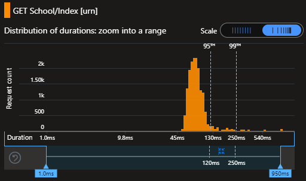
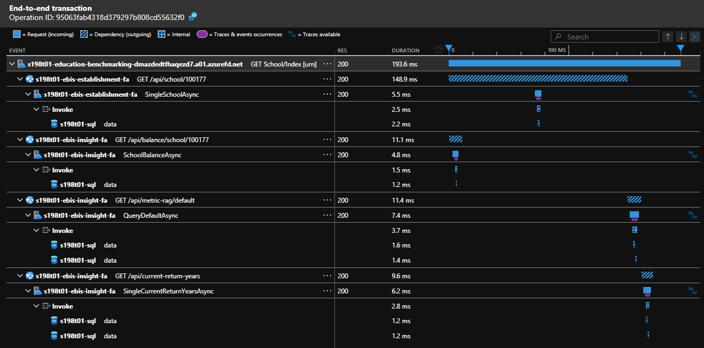

# Performance Test Plan - 0004 - Web App Average Load

**Test run date:**

September 2024

## Goal

The goal of this test is to measure how well the service performs under typical load conditions. Focus will be on verifying the critical pages.

## Objective

- Establish a performance baseline under typical load conditions.
- Simulate real-world conditions to understand the services responsiveness during average traffic patterns.
- Ensure that the service remains stable without crashes or timeouts  during normal usage.
- Confirm that the service deliver consistent performance over time and does not degrade with continued use.

## Procedure

**Determine Capacity:**

Calculate the number of `Virtual Users` required for Azure Load Testing based on a target throughput.

_NB: see previous test plans for calculation._

**Average Load Phase:**

For each page, simulate the typical number of concurrent virtual users to mimic average load conditions over a period of 5 minutes.

**Monitoring Performance:**

- Response Time
  - Definition: The duration between sending a request and receiving a response.
  - Measurement: This will be produced as an output of the test run.
- Error Percentage
  - Definition: The percentage of requests that result in an error response (5xx).
  - Measurement: This will be produced as an output of the test run.
- Throughput
  - Definition: The number of requests processed per second.
  - Measurement: This will be produced as an output of the test run.
- CPU and Memory utilisation
  - Definition: The average percentage utilisation.
  - Measurement: Monitor resource usage to ensure the infrastructure efficiently handles the load.
- Database performance
  - Definition: The average percentage of DTU utilisation.
  - Measurement: Monitor resource usage to ensure the infrastructure efficiently handles the load.

**Pages Under Test:**

| Page                                           | Target Throughput |
|------------------------------------------------|-------------------|
| `/school/{identifier}`                         | 50 /s             |
| `/school/{identifier}/spending-and-costs`      | 50 /s             |
| `/school/{identifier}/comparators`             | 50 /s             |
| `/school/{identifier}/find-ways-to-spend-less` | 50 /s             |
| `/trust/{identifier}`                          | 23 /s             |
| `/trust/{identifier}/spending-and-costs`       | 23 /s             |

*the target throughput is based on the assumed daily user numbers, and 45% of being academy trust users.

## Performance Success Criteria

- Response Time:
  - P50 below 200ms
  - P95 below 300ms
  - P99 below 1000ms
- Error Rate:  below 0.1%
- CPU and Memory utilisation : below 50%*
- Database performance : below 50%*

*based on production tiers P1v3 for app service & S2 (50DTU) for database.

## Test Execution

- Load pattern: Linear
- Test duration (minutes): 5
- Ramp-up time (minutes): 1

## Test Output

**Summary Report:**

<!-- take care with final separator line in piped table, as pandoc uses this for relative column widths -->
| Load Test Name | Initiated on         | Max VUs | Duration | Response time | Errors | Throughput | Result      |
|----------------|----------------------|---------|----------|---------------|--------|------------|-------------|
| School Home    | 09/09/2024, 15:24:10 | 6       | 5m 53s   | 177 ms        | 0%     | 37.51 /s   | [❌ Failed](https://portal.azure.com/#blade/Microsoft_Azure_CloudNativeTesting/NewReport/resourceId/%2Fsubscriptions%2Fa5c0a8d7-a54d-4a6d-ab79-4ca64a3b750f%2Fresourcegroups%2Fs198t01-ebis-perf-tests%2Fproviders%2Fmicrosoft.loadtestservice%2Floadtests%2Fs198t01-load-tests/testId/32e87f8f-e0a2-4393-ad0e-13559aead029/testRunId/ad67a760-d021-47b6-9a84-d9747f649163) 1️⃣ |
| School Home    | 09/09/2024, 16:36:54 | 10      | 5m 57s   | 200 ms        | 0%     | 54.30 /s   | [✅ Passed](https://portal.azure.com/#blade/Microsoft_Azure_CloudNativeTesting/NewReport/resourceId/%2Fsubscriptions%2Fa5c0a8d7-a54d-4a6d-ab79-4ca64a3b750f%2Fresourcegroups%2Fs198t01-ebis-perf-tests%2Fproviders%2Fmicrosoft.loadtestservice%2Floadtests%2Fs198t01-load-tests/testId/32e87f8f-e0a2-4393-ad0e-13559aead029/testRunId/a1eaae12-8343-4460-a3ab-88364b8be04c)     |

**Findings and Recommendations:**

1️⃣ _School Home_ failed on initial runs due to poor performance against the test criteria at that time. e.g.:

| Metric        | Aggregate function | Condition    | Threshold | Request name | Actual value | Result   |
|---------------|--------------------|--------------|-----------|--------------|--------------|----------|
| Response time | 75th percentile    | Greater than | 100       |              | 112          | ❌ Failed |
| Response time | 95th percentile    | Greater than | 150       |              | 267          | ❌ Failed |
| Response time | 99th percentile    | Greater than | 500       |              | 1030         | ❌ Failed |
| Error         | Percentage         | Greater than | 0.1       |              | 0            | ✅ Passed |

It is not consistent between sample requests as to where the source of this issue lay but it was observed that Database CPU was high. Setting the test environment to match what is in production (S2 - 50 DTU) seemed to alleviate the issue. More generous test thresholds have also since been defined.

<!-- Leave the rest of this page blank -->
\newpage
