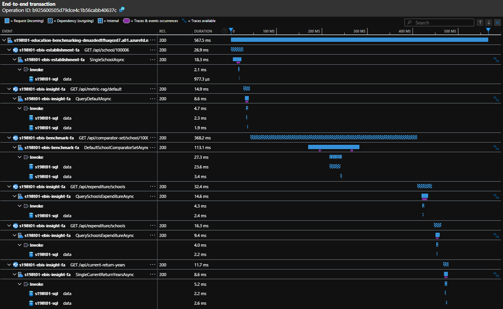
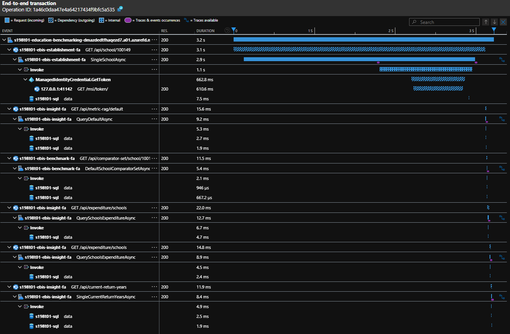
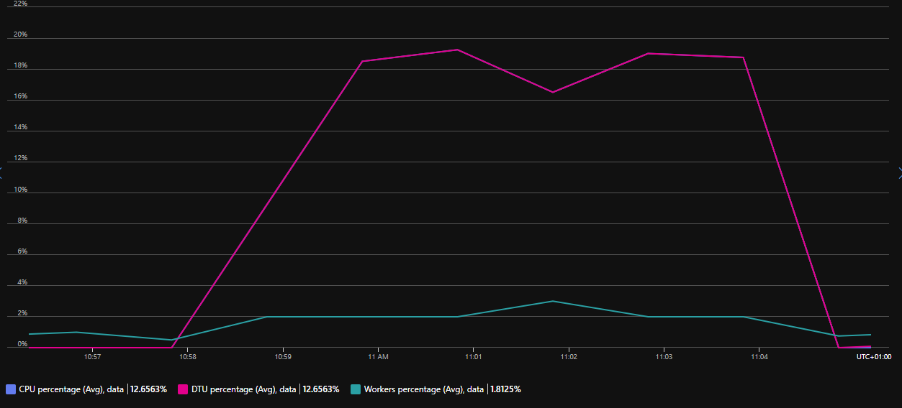
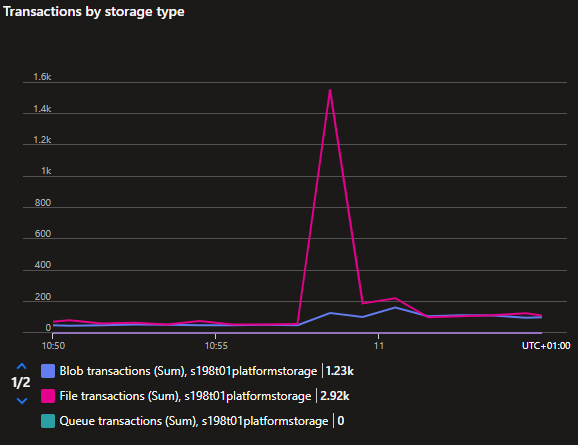
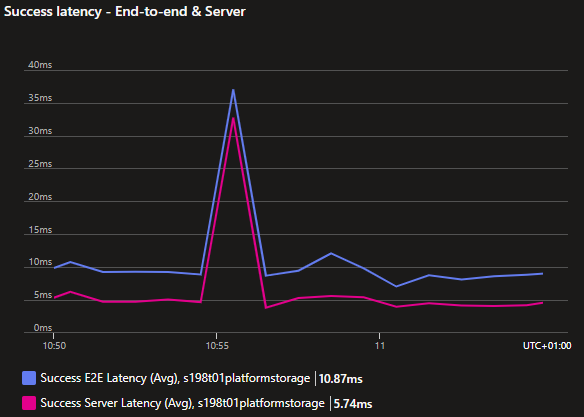
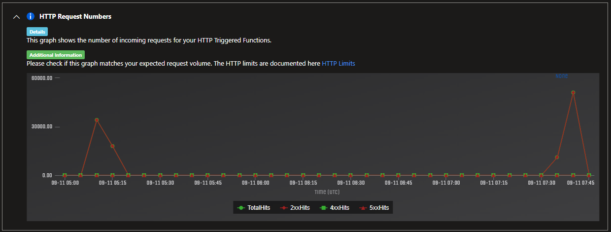
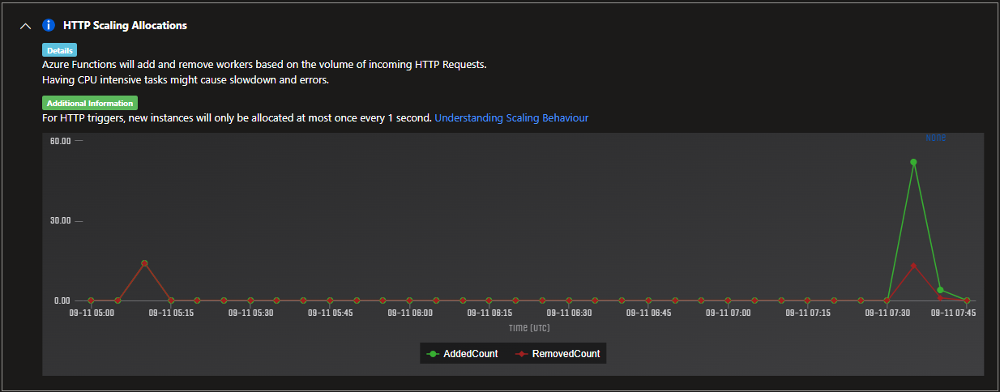
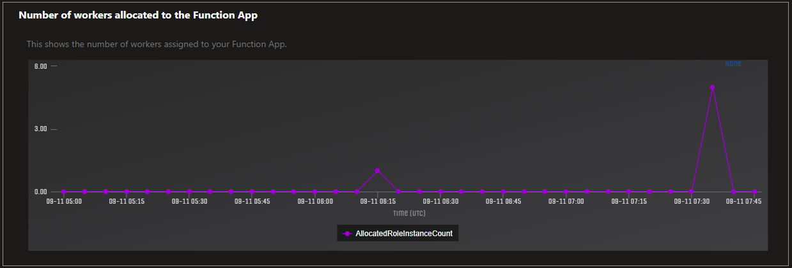

# Performance Test Plan - 0004 - Web App Average Load

**Test run date:**

September 2024

## Goal

The goal of this test is to measure how well the service performs under typical load conditions. Focus will be on verifying the critical pages.

## Objective

- Establish a performance baseline under typical load conditions.
- Simulate real-world conditions to understand the services responsiveness during average traffic patterns.
- Ensure that the service remains stable without crashes or timeouts  during normal usage.
- Confirm that the service deliver consistent performance over time and does not degrade with continued use.

## Procedure

**Determine Capacity:**

Calculate the number of `Virtual Users` required for Azure Load Testing based on a target throughput.

_NB: see previous test plans for calculation._

**Average Load Phase:**

For each page, simulate the typical number of concurrent virtual users to mimic average load conditions over a period of 5 minutes.

**Monitoring Performance:**

- Response Time
  - Definition: The duration between sending a request and receiving a response.
  - Measurement: This will be produced as an output of the test run.
- Error Percentage
  - Definition: The percentage of requests that result in an error response (5xx).
  - Measurement: This will be produced as an output of the test run.
- Throughput
  - Definition: The number of requests processed per second.
  - Measurement: This will be produced as an output of the test run.
- CPU and Memory utilisation
  - Definition: The average percentage utilisation.
  - Measurement: Monitor resource usage to ensure the infrastructure efficiently handles the load.
- Database performance
  - Definition: The average percentage of DTU utilisation.
  - Measurement: Monitor resource usage to ensure the infrastructure efficiently handles the load.

**Pages Under Test:**

| Page                                           | Target Throughput |
|------------------------------------------------|-------------------|
| `/school/{identifier}`                         | 50 /s             |
| `/school/{identifier}/spending-and-costs`      | 50 /s             |
| `/school/{identifier}/comparators`             | 50 /s             |
| `/school/{identifier}/find-ways-to-spend-less` | 50 /s             |
| `/trust/{identifier}`                          | 23 /s             |
| `/trust/{identifier}/spending-and-costs`       | 23 /s             |

*the target throughput is based on the assumed daily user numbers (of which 45% are academy trust users).

## Performance Success Criteria

- Response Time:
  - P75 below 500ms
  - P95 below 1000ms
  - P99 below 2000ms
- Error Rate: below 0.1%
- CPU and Memory utilisation: below 50%*
- Database performance: below 50%*

*based on production tiers P1v3 for app service & S2 (50DTU) for database.

## Test Execution

- Load pattern: Linear
- Test duration (minutes): 6
- Ramp-up time (minutes): 1

## Test Output

**Summary Report:**

<!-- take care with final separator line in piped table, as pandoc uses this for relative column widths -->
| Load Test Name             | Initiated on         | Max VUs | Duration | Response time | Errors | Throughput | Result      |
|----------------------------|----------------------|---------|----------|---------------|--------|------------|-------------|
| School Home                | 09/09/2024, 15:24:10 | 6       | 5m 53s   | 177 ms        | 0 %    | 37.51 /s   | [❌ Failed](https://portal.azure.com/#blade/Microsoft_Azure_CloudNativeTesting/NewReport/resourceId/%2Fsubscriptions%2Fa5c0a8d7-a54d-4a6d-ab79-4ca64a3b750f%2Fresourcegroups%2Fs198t01-ebis-perf-tests%2Fproviders%2Fmicrosoft.loadtestservice%2Floadtests%2Fs198t01-load-tests/testId/32e87f8f-e0a2-4393-ad0e-13559aead029/testRunId/ad67a760-d021-47b6-9a84-d9747f649163) 1️⃣ |
| School Home                | 11/09/2024, 11:51:05 | 10      | 6m 1s    | 217 ms        | 0 %    | 52.86 /s   | [✅ Passed](https://portal.azure.com/#blade/Microsoft_Azure_CloudNativeTesting/NewReport/resourceId/%2Fsubscriptions%2Fa5c0a8d7-a54d-4a6d-ab79-4ca64a3b750f%2Fresourcegroups%2Fs198t01-ebis-perf-tests%2Fproviders%2Fmicrosoft.loadtestservice%2Floadtests%2Fs198t01-load-tests/testId/32e87f8f-e0a2-4393-ad0e-13559aead029/testRunId/0328b51c-286b-4fdc-aee4-c48afa5cd330)     |
| School Spending Priorities | 10/09/2024, 08:14:37 | 12      | 5m 55s   | 292 ms        | 1.06 % | 37.90 /s   | [❌ Failed](https://portal.azure.com/#blade/Microsoft_Azure_CloudNativeTesting/NewReport/resourceId/%2Fsubscriptions%2Fa5c0a8d7-a54d-4a6d-ab79-4ca64a3b750f%2Fresourcegroups%2Fs198t01-ebis-perf-tests%2Fproviders%2Fmicrosoft.loadtestservice%2Floadtests%2Fs198t01-load-tests/testId/64328db8-47e9-4214-9182-b5b7505ff027/testRunId/0b704fe3-18d0-45c6-b99b-cb54f42ba05b) 2️⃣ |
| School Spending Priorities | 10/09/2024, 10:16:06 | 12      | 5m 59s   | 313 ms        | 0.04 % | 34.76 /s   | [❌ Failed](https://portal.azure.com/#blade/Microsoft_Azure_CloudNativeTesting/NewReport/resourceId/%2Fsubscriptions%2Fa5c0a8d7-a54d-4a6d-ab79-4ca64a3b750f%2Fresourcegroups%2Fs198t01-ebis-perf-tests%2Fproviders%2Fmicrosoft.loadtestservice%2Floadtests%2Fs198t01-load-tests/testId/64328db8-47e9-4214-9182-b5b7505ff027/testRunId/7acae41b-b17b-43ff-9dff-017d60431280) 3️⃣ |
| School Spending Priorities | 11/09/2024, 11:31:08 | 15      | 6m 1s    | 404 ms        | 0 %    | 48.52 /s   | [✅ Passed](https://portal.azure.com/#blade/Microsoft_Azure_CloudNativeTesting/NewReport/resourceId/%2Fsubscriptions%2Fa5c0a8d7-a54d-4a6d-ab79-4ca64a3b750f%2Fresourcegroups%2Fs198t01-ebis-perf-tests%2Fproviders%2Fmicrosoft.loadtestservice%2Floadtests%2Fs198t01-load-tests/testId/64328db8-47e9-4214-9182-b5b7505ff027/testRunId/0328b51c-286b-4fdc-aee4-c48afa5cd030)     |
| School Comparators         | 11/09/2024, 15:02:47 | 10      | 5m 42s   | 218 ms        | 0 %    | 45.84 /s   | [✅ Passed](https://portal.azure.com/#blade/Microsoft_Azure_CloudNativeTesting/NewReport/resourceId/%2Fsubscriptions%2Fa5c0a8d7-a54d-4a6d-ab79-4ca64a3b750f%2Fresourcegroups%2Fs198t01-ebis-perf-tests%2Fproviders%2Fmicrosoft.loadtestservice%2Floadtests%2Fs198t01-load-tests/testId/f23b0c7c-217a-4976-80a5-996db09a5008/testRunId/f23b0c7c-217a-4976-80a5-996db09a5083)     |
| School Resources           | 11/09/2024, 15:12:12 | 10      | 6m 0s    | 192 ms        | 0 %    | 55.56 /s   | [✅ Passed](https://portal.azure.com/#blade/Microsoft_Azure_CloudNativeTesting/NewReport/resourceId/%2Fsubscriptions%2Fa5c0a8d7-a54d-4a6d-ab79-4ca64a3b750f%2FresourceGroups%2Fs198t01-ebis-perf-tests%2Fproviders%2FMicrosoft.LoadTestService%2Floadtests%2Fs198t01-load-tests/testId/f23b0c7c-217a-4976-80a5-996db09a504e/testRunId/5ca1e91f-6e08-4cbc-b759-a3f7220980e3)     |

**Findings and Recommendations:**

1️⃣ _School Home_ failed on initial runs due to poor performance against the test criteria at that time. e.g.:


It is not consistent between sample requests as to where the source of this issue lay but it was observed that Database CPU was high. Setting the test environment to match what is in production (S2 - 50 DTU) seemed to alleviate the issue.


2️⃣ _School Spending Priorities_ failed on initial runs due to high error rates caused by a data issue with the specific URN `100049`:

```text
System.DivideByZeroException:
   at System.Decimal+DecCalc.VarDecDiv (System.Private.CoreLib, Version=8.0.0.0, Culture=neutral, PublicKeyToken=7cec85d7bea7798e)
   at Web.App.ViewModels.SchoolSpendingViewModel.Stats (Web.App, Version=1.0.196.0, Culture=neutral, PublicKeyToken=null: /home/vsts/work/1/s/web/src/Web.App/ViewModels/SchoolSpendingViewModel.cs:44)
   at AspNetCoreGeneratedDocument.Views_SchoolSpending__Costs+<ExecuteAsync>d__0.MoveNext (Web.App, Version=1.0.196.0, Culture=neutral, PublicKeyToken=null: /home/vsts/work/1/s/web/src/Web.App/Views/SchoolSpending/_Costs.cshtml:27)
   ...
```

3️⃣ _School Spending Priorities_ failed on subsequent runs due to poor performance against the test criteria at that point in time, even when the app service was scaled to match what is in production (P1v3). The following query was used in Application Insights to identify the worst performing requests for investigation:

```sql
requests
| where timestamp > datetime("2024-09-10T09:15:00.000Z") 
    and timestamp < datetime("2024-09-10T09:20:00.000Z")
| where duration > 500
| where isempty(application_Version) == false
| order by timestamp desc
```

When viewing sample transactions it seemed as though the dependent API calls may have been the cause of the longer than expected durations, specifically with unaccounted for overheads when resolving the dependency via the proxy. e.g.:



Extended durations were also reported from APIs when resolving the managed identity token, but these are far between e.g.:



**Possible causes:**

1. Database

    - Azure Load Testing does report very high CPU, but this is a misleading metric in that view
    - drilling down to the database directly does not show any adverse effect on DTU, e.g.:

    

1. Logging configuration

    - log level currently set to `Information` leading to large amount of noise (see [#1348](https://github.com/DFE-Digital/education-benchmarking-and-insights/pull/1348))
    - legacy Serilog configuration (removed in [41e986b](https://github.com/DFE-Digital/education-benchmarking-and-insights/commit/41e986be22c67bae1d7e9b7ba6d8258bf1ce1958))
    - Code Optimizations† (under `Application Insights` > `Performance`) also has three entries for:

    > `LoggingScopeHttpMessageHandler.SendAsync` is causing unusually high CPU usage

1. Storage account transactions

    - after Diagnostic Settings were added to Platform Storage accounts this could be analysed and nothing untoward was observed, e.g.:

    
    

1. Function auto-scaling

    - potentially caused by an overhead during scaling of the Function App
    - instance and worker counts may be analysed in the Function App under `Diagnose and solve problems` > `Search` > `HTTP Functions Scaling` [1](https://github.com/Azure/Azure-Functions/issues/2323#issue-1526659675)
    - different scaling options set on `Scale out` > `Dynamic Scale out` > `Maximum Scale Out Limit`
    - observations for (e.g.) Insights API, with the first spike from a test run with maximum scale out to `1` and the second spike with the default `200`:

    
    
    

    - analysis showed fewer unaccounted for overheads in the timeline with maximum scale out set to `1` (subject to additional analysis)

† Code Optimizations is part of Application Insights Profiler, which [does not support](https://learn.microsoft.com/en-us/azure/azure-monitor/profiler/profiler-troubleshooting#are-you-using-the-right-azure-service-plan) Azure Function Apps on Consumpion Plans. This limits the profiling that may be performed on the Function Apps at this time.

<!-- Leave the rest of this page blank -->
\newpage
