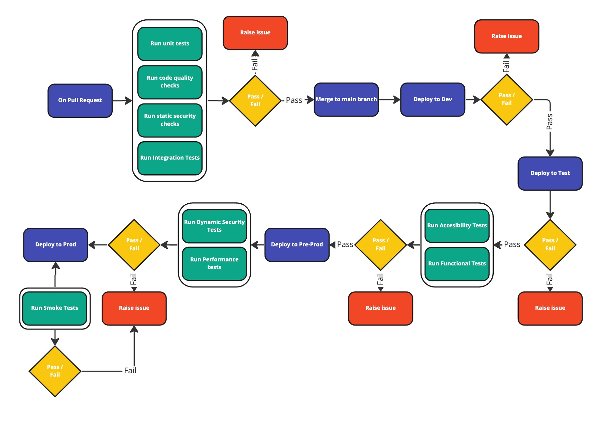
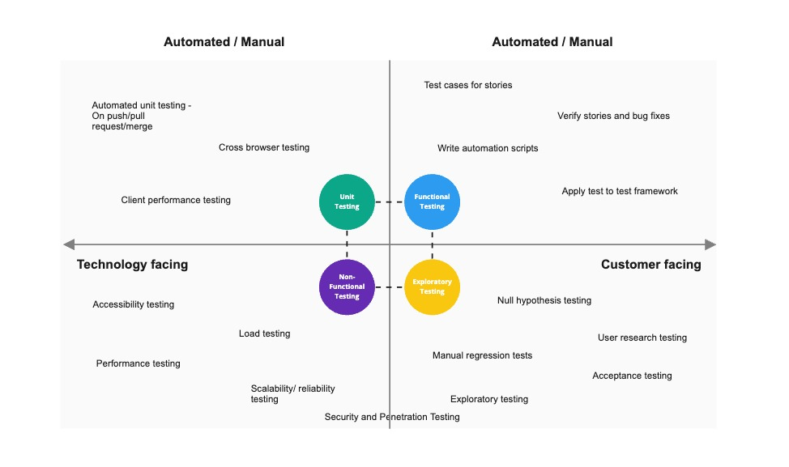
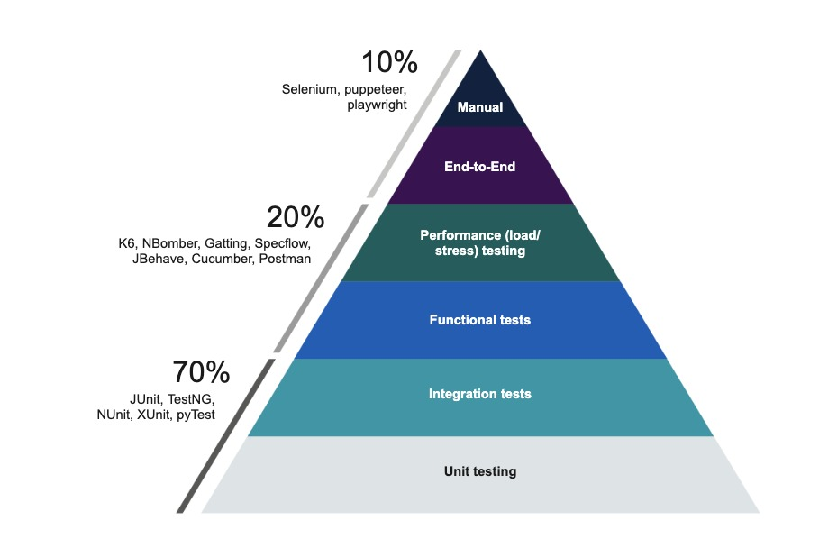

# Test strategy

# Introduction and scope

//TODO: A short introduction to the project, include background, integrations and references to architecture documentation, also include timelines and milestones if relevant.

## Sign off and approvers

| Name    | Role | Approved | Date |
|---------|------|----------|------|
| QA Name | Test Lead | [X] | 01/01/2021 |

# Summary of access requirements 

//TODO: Document access requirements needed to carry the different levels of testing

# Test environment 

//TODO: Include an overview of the test environment, number of supported tests, any software licenses

## Path to live

//TODO: Create a path to live diagram, that visualises the stage gates from ideation through to release

# Testing approach

//TODO: Introduction to the test approach and types of testing included in the project

| Level of testing | Responsible role(s) |
|------------------|---------------------|
| Unit | Developer, Tech Lead |
| Integration | Developer, QA |
| Functional | Test Engineer,QA | 
| Performance | Test Engineer, QA | 
| Security | Security Engineer, Pen Tester, QA | 
| Accessibility | Test Engineer, UX, QA |  

//TODO: Define the scope of testing, include the activities at each phase of the testing cycle. Add information or delete these sections as relevant

## Test data overview

//TODO: Describe how you will create a manage test data

## Risk mapping and analysis 

//TODO: Identify the areas of highest risk in the project and actions to mitigate them

| Risk | Mitigation |
|------|------------|
| Legacy systems difficult to mock completely | Create lightweight mocks on a need to use basis | 

## Change management and release tracking

//TODO: Describe how change management and release tracking will be carried out. If using agile tools like JIRA or Devops this should also include source code tracability, e.g. connect JIRA to Github to trace source code changes to issues and stories.

## Types of testing

### Unit testing 

//TODO: Describe what unit testing means in the scope of this project

#### Technology selection

//TODO: include technologies to be used in this type of testing if this will be manually tested state that in this section

#### Success criteria

//TODO: Include quality metrics and success criteria this often contributes to the definition of done.

### Integration testing 

//TODO: Describe what integration testing means in the scope of this project

#### Technology selection

//TODO: include technologies to be used in this type of testing if this will be manually tested state that in this section

//TODO: Include any contract based testing strategy that you might need

#### Success criteria

//TODO: Include quality metrics and success criteria this often contributes to the definition of done.

### Functional testing 
 
//TODO: Describe what functional testing means in the scope of this project, be clear about what will have to be mocked/stubbed/faked in this phase of testing.

#### Technology selection

//TODO: include technologies to be used in this type of testing if this will be manually tested state that in this section

//TODO: Also include here any cross browser testing and target browsers that you might need.

#### Success criteria

//TODO: Include quality metrics and success criteria this often contributes to the definition of done.

### Performance testing 

//TODO: Describe what performance testing means in the scope of this project

#### Technology selection

//TODO: include technologies to be used in this type of testing if this will be manually tested state that in this section

#### Success criteria

//TODO: Include quality metrics and success criteria this often contributes to the definition of done.

### Accessibility testing 
 
//TODO: Describe what accessibility testing means in the scope of this project

#### Technology selection

//TODO: include technologies to be used in this type of testing if this will be manually tested state that in this section

#### Success criteria

//TODO: Include quality metrics and success criteria this often contributes to the definition of done.

### Security testing 

 
//TODO: Describe what security testing means in the scope of this project

#### Technology selection

//TODO: include technologies to be used in this type of testing if this will be manually tested state that in this section

#### Success criteria

//TODO: Include quality metrics and success criteria this often contributes to the definition of done.
