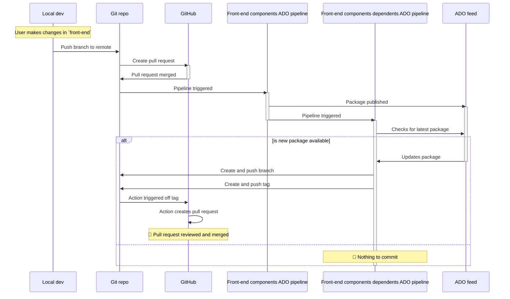

# Front end components (React + TypeScript + Vite)

This project provides components to be consumed by the front-end ASP.NET Core web app.

## Development Standards

- **Progressive Enhancement**: Components must gracefully handle being mounted into existing server-rendered HTML.
- **GOV.UK Compliance**: All UI must strictly adhere to GDS (Government Digital Service) accessibility and style standards.
- **Surgical Mounts**: Avoid wrapping the entire page in React; target specific interactive widgets.
- **Strict Typing**: No `any`. Use the domain types defined in `src/services/types.tsx`.
- **Testing**: Every new view or complex component MUST have a corresponding test in the `__tests__` directory or alongside the file.
- **Formatting & Linting**: TypeScript/React code must pass `npm run lint` (ESLint) and adhere strictly to the local `.prettierrc` configuration.

## Anti-Patterns

- **Ignoring Accessibility (a11y)**: Never compromise semantic HTML. Avoid building custom dropdowns or inputs if `govuk-frontend` or native HTML elements can achieve the same result.
- **Global State Overkill**: Do not introduce Redux or similar libraries; keep state as local as possible or use Context.
- **Direct DOM Manipulation**: Never touch the host DOM outside the React root; use refs if absolutely necessary.
- **Style Divergence**: Do not use custom CSS for things already provided by the GOV.UK Design System.
- **Bypassing Services**: Never call `fetch` directly from a component; always use a defined service wrapper.

## Pre-requisites

- Install [Node 22](https://nodejs.org/en/download) and/or switch to this version using [nvm](https://github.com/nvm-sh/nvm)

> **Note:** For IDE configuration (like ESLint and Prettier setup in VS Code), refer to the centralized [Linting and Formatting guide](../documentation/developers/05_Linting-and-Formatting.md).

## Available views

| Views                     | Properties                       | Root Id             |
|---------------------------|----------------------------------|---------------------|
| Compare your school costs | urn, maintainedYear, academyYear | compare-your-school |
| Compare your workforce    | urn, maintainedYear, academyYear | compare-census      |

## Build & validate

The 'build and copy' scripts within this project's root folder may be used to generate a version of
the components to use for local validation within the consuming Web project.

## Build & release

The `Front-end components` build pipeline in Azure DevOps is triggered upon changes to this project's
folder. This runs build, lint and test scripts to check the quality of the changes.

On merging to `main`, the package is also version bumped and pushed to the [private feed](https://dfe-ssp.visualstudio.com/s198-DfE-Benchmarking-service/_artifacts/feed/education-benchmarking).
To manually consume the newly released package in the Web ASP.NET application, authenticate with Azure
DevOps and then pull the latest version of the `front-end` package with `npm update front-end`.

Alternatively, wait for Azure DevOps Pipelines and GitHub Actions to create a PR that automatically
includes the bumped dependency version as per the process below:

```mermaid
sequenceDiagram
    accDescr: Bump front-end and create Pull Request
    
    participant Local dev
    participant Git repo
    participant GitHub
    participant Front-end components ADO pipeline
    participant Front-end components dependents ADO pipeline
    participant ADO feed

    Note over Local dev: User makes changes in `front-end`
    Local dev->>Git repo: Push branch to remote
    Git repo->>GitHub: Create pull request
    activate GitHub
    GitHub->>Git repo: Pull request merged
    deactivate GitHub
    Git repo->>Front-end components ADO pipeline: Pipeline triggered
    activate Front-end components ADO pipeline
    Front-end components ADO pipeline->>ADO feed: Package published
    activate ADO feed
    Front-end components ADO pipeline->>Front-end components dependents ADO pipeline: Pipeline triggered
    deactivate Front-end components ADO pipeline
    activate Front-end components dependents ADO pipeline
    Front-end components dependents ADO pipeline->>ADO feed: Checks for latest package

    alt is new package available
        ADO feed->>Front-end components dependents ADO pipeline: Updates package
        deactivate ADO feed
        Front-end components dependents ADO pipeline->>Git repo: Create and push branch
        Front-end components dependents ADO pipeline->>Git repo: Create and push tag

        Git repo->>GitHub: Action triggered off tag
        GitHub->>GitHub: Action creates pull request 
        Note over GitHub: 🏁 Pull request reviewed and merged
    else
        Note over Front-end components dependents ADO pipeline: 🏁 Nothing to commit
    end

    deactivate Front-end components dependents ADO pipeline
```
