# Front end components (React + TypeScript + Vite)

This project provides components to be consumed by the front-end ASP.NET Core web app.

## Pre-requisites

- Install [Node 22](https://nodejs.org/en/download) and/or switch to this version using [nvm](https://github.com/nvm-sh/nvm)

When developing this application in Visual Studio Code, the following extensions are recommended:

- [ESLint](https://marketplace.visualstudio.com/items?itemName=dbaeumer.vscode-eslint)
- [markdownlint](https://marketplace.visualstudio.com/items?itemName=DavidAnson.vscode-markdownlint)
- [Prettier ESLint](https://marketplace.visualstudio.com/items?itemName=rvest.vs-code-prettier-eslint)
(along with the recommended [project settings](https://marketplace.visualstudio.com/items?itemName=rvest.vs-code-prettier-eslint#project-settings))

## Available views

| Views                     | Properties                       | Root Id             |
|---------------------------|----------------------------------|---------------------|
| Compare your school costs | urn, maintainedYear, academyYear | compare-your-school |
| Compare your workforce    | urn, maintainedYear, academyYear | compare-census      |

## Build & validate

The 'build and copy' scripts within this project's root folder may be used to generate a version of the
components to use for local validation within the consuming Web project.

## Build & release

The `Front-end components` build pipeline in Azure DevOps is triggered upon changes to this project's
folder. This runs build, lint and test scripts to check the quality of the changes.

On merging to `main`, the package is also version bumped and pushed to the [private feed](https://dfe-ssp.visualstudio.com/s198-DfE-Benchmarking-service/_artifacts/feed/education-benchmarking).
To manually consume the newly released package in the Web ASP.NET application, authenticate with Azure
DevOps and then pull the latest version of the `front-end` package with `npm update front-end`.

Alternatively, wait for Azure DevOps Pipelines and GitHub Actions to create a PR that automatically
includes the bumped dependency version as per the process below:

```mermaid
sequenceDiagram
    accDescr: Bump front-end and create Pull Request
    
    participant Local dev
    participant Git repo
    participant GitHub
    participant Front-end components ADO pipeline
    participant Front-end components dependents ADO pipeline
    participant ADO feed

    Note over Local dev: User makes changes in `front-end`
    Local dev->>Git repo: Push branch to remote
    Git repo->>GitHub: Create pull request
    activate GitHub
    GitHub->>Git repo: Pull request merged
    deactivate GitHub
    Git repo->>Front-end components ADO pipeline: Pipeline triggered
    activate Front-end components ADO pipeline
    Front-end components ADO pipeline->>ADO feed: Package published
    activate ADO feed
    Front-end components ADO pipeline->>Front-end components dependents ADO pipeline: Pipeline triggered
    deactivate Front-end components ADO pipeline
    activate Front-end components dependents ADO pipeline
    Front-end components dependents ADO pipeline->>ADO feed: Checks for latest package

    alt is new package available
        ADO feed->>Front-end components dependents ADO pipeline: Updates package
        deactivate ADO feed
        Front-end components dependents ADO pipeline->>Git repo: Create and push branch
        Front-end components dependents ADO pipeline->>Git repo: Create and push tag

        Git repo->>GitHub: Action triggered off tag
        GitHub->>GitHub: Action creates pull request 
        Note over GitHub: 🏁 Pull request reviewed and merged
    else
        Note over Front-end components dependents ADO pipeline: 🏁 Nothing to commit
    end

    deactivate Front-end components dependents ADO pipeline
```

