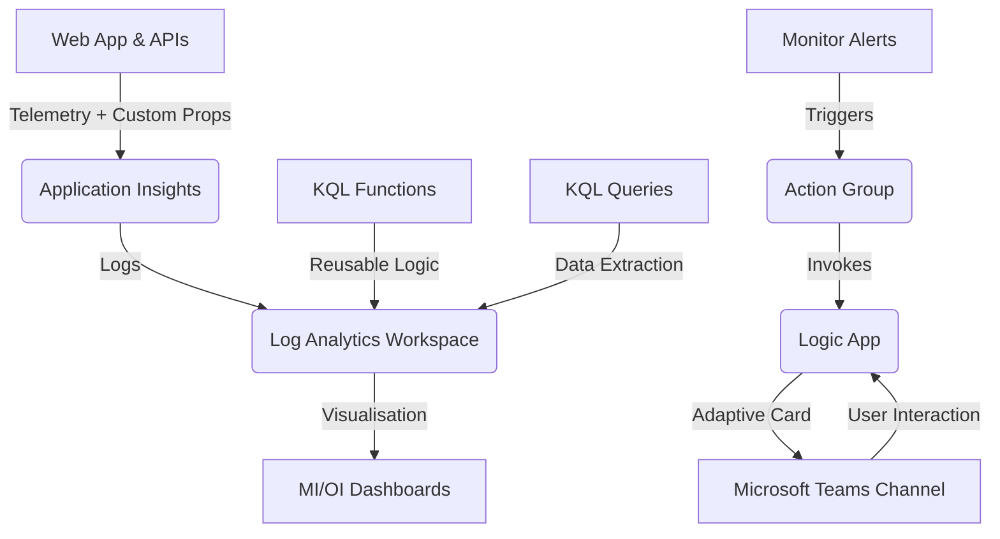

# Support & Analytics Module Context

## Module Purpose

The `support-analytics` module is a supplementary infrastructure-as-code and
configuration project dedicated to monitoring, alerting, and operational
insights for the SFB (School Financial Benchmarking) service. It provides
centralized visibility into system health (Operational Information) and user
behavior (Management Information) while automating incident notifications to
Microsoft Teams.

## Tech Stack

- **Infrastructure:** Terraform (AzureRM provider `~> 4.51.0`, Random provider
  `3.7.2`)
- **Monitoring:** Azure Monitor, Application Insights, Log Analytics (Query
  Packs & Saved Searches)
- **Automation:** Azure Logic Apps, Azure Monitor Action Groups
- **Notification UI:** Adaptive Cards (JSON schema v1.5)
- **Query Languages:** KQL (Kusto Query Language), T-SQL (for manual database
  maintenance/checks)
- **Visualization:** Azure Portal Dashboards (.tpl templates)

## Core Logic & Data Flow

1. **Ingestion:** Telemetry from application modules includes custom business
   dimensions (e.g., `Urn`, `Code`, `Feature`, `Establishment`).
2. **Analysis:** KQL functions (Saved Searches) and queries (Query Pack)
   provide structured access to logs.
3. **Alerting:** Scheduled Query Rules and Metric Alerts monitor for
   performance anomalies or high error rates.
4. **Automation:** The Logic App receives alert payloads, formats them into
   environment-specific Adaptive Cards, and manages message state (Firing,
   Assigned, Resolved) in Teams.

## Key Definitions

- **Query Pack:** An Azure resource containing version-controlled KQL queries
  for discovery and dashboarding.
- **Saved Search (Function):** A KQL snippet aliased as a function name (e.g.,
  `GetRequests`) for reuse across multiple queries.
- **OI Dashboard (Operational Information):** Focused on system reliability
  (availability, latency, HTTP 5xx rates).
- **MI Dashboard (Management Information):** Focused on product usage
  (sessions, active users, feature popularity).
- **Adaptive Card:** A JSON-defined UI template used to deliver rich,
  actionable alert notifications in Teams.
- **Action Group:** The routing mechanism that connects an Azure Alert to the
  Logic App trigger.

## Integration Points

- **Web (`/web`):** The primary source of request-level telemetry and custom
  dimension logging.
- **Platform (`/platform`):** The host for the backend APIs being monitored
  (Establishment, Benchmark, Insight, etc.).
- **Core Infrastructure (`/core-infrastructure`):** Provides the base
  Application Insights and Log Analytics Workspace resources.
- **Microsoft Teams:** The target for all operational alerting and incident
  management.

## Development Standards

- **KQL Externalization:** KQL must be stored in `.kql` files within
  `terraform/queries/` or `terraform/queries/functions/`.
- **Documentation Quality:** All Markdown files must adhere to the repository-wide linting standards enforced via pre-commit hooks and CI checks.
- **Function vs. Query:** Use `azurerm_log_analytics_saved_search` for
  reusable functions and `azurerm_log_analytics_query_pack_query` for
  standalone dashboard/discovery queries.
- **Tokenization:** Environment-specific values in KQL or JSON must be
  tokenized as `${TOKEN_NAME}` and injected via Terraform's `templatefile()`
  function.
- **Dashboard Maintenance:** Modify dashboards interactively in the Azure
  Portal, then export the JSON to `terraform/dashboards/*.tpl` files and apply
  tokenization before committing.
- **Logic App Deployment:** The Logic App uses
  `azurerm_logic_app_action_custom` for fine-grained workflow control; changes
  should be tested in a development environment first.
- **Teams API Authorization:** The `teams-api-connection` resource creates the
  API connection but *does not* authorize it. Authorization must be performed
  manually in the Azure Portal.

## Anti-Patterns

- **Modifying Teams API Display Name:** Do not change the `display_name` of the
  `teams-api-connection` in Terraform. This forces resource replacement and
  will silently drop the manual Azure Portal O365 authorization, breaking all
  alerts.
- **Mixing SQL and KQL:** Do not put T-SQL validation scripts (found in
  `./queries`) into the `terraform/queries` deployment pipeline, and vice
  versa.
- **Hardcoding GUIDs:** Never hardcode environment-specific resource IDs or
  Teams channel IDs; use variables and data sources.
- **Portal-Only Changes:** Avoid creating alerts or dashboards directly in the
  Portal without backporting them to Terraform.
- **Direct SQL Alerts:** Do not use T-SQL queries against the production
  database for real-time alerting; use KQL against the logs instead.
- **Schema Versions:** Do not use Adaptive Card schema versions >1.5 as they
  are not currently supported by Microsoft Teams.
- **Missing Telemetry:** Avoid adding new features to the Web project without
  ensuring appropriate custom properties are logged for tracking in MI
  dashboards.
